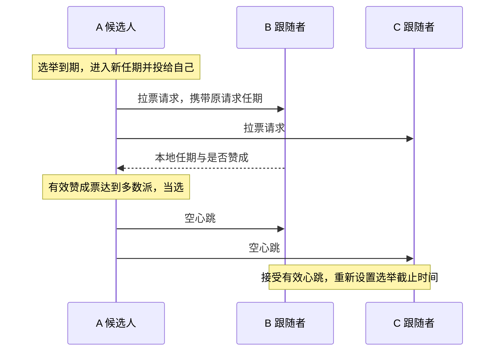

# Raft 核心实现与学习项目

这是我从零学习 Go 并逐步实现 Raft 的项目，目标覆盖 MIT 6.5840 2026 Lab 3A～3D 的选举、日志复制、持久化和快照。当前已完成 3A、3B 和 3C；最新 -race 回归通过21项官方测试，另有25项辅助测试通过。下一阶段是3D快照；结果见测试记录。

本公开目录保存项目说明和复习文档，不包含实验源码；完整代码位于同级 project 目录，供本地和私有仓库使用。原来的 C++ 练习继续保留。[MIT 协作政策](https://pdos.csail.mit.edu/6.824/labs/collab.html)要求含实验实现的 GitHub 仓库设为私有。

## 1. 当前完成到哪里

Lab 3A 的目标是：正常网络中选出领导者并保持稳定；旧领导者断网后，仍能通信的多数派选出新领导者。我已在原目录运行官方 3A 测试并报告通过；整理后的独立版本也已验证，记录见 [测试记录](docs/verification.md)。

| 阶段 | 内容 | 当前状态 |
| --- | --- | --- |
| 3A | 任期、投票、选举、心跳与后台计时 | 已实现，验收结果见测试记录 |
| 3B | 日志复制、冲突修复、多数派提交与顺序交付 | 已实现，官方 3B 通过；最新回归见测试记录 |
| 3C | 任期、投票和日志的保存与恢复 | 已实现，官方3C通过；包含冲突回退优化 |
| 3D | 快照与日志压缩 | 未实现 |

3A～3C覆盖选举、日志共识及实验保存容器中的重启恢复；3D快照尚未实现，不能据此声称完成生产磁盘引擎、生产级Raft或容错KV服务。

## 项目目标与阶段记录

项目目标是逐步完成 MIT 6.5840 Lab 3A～3D 对应的 Raft 核心实现，并积累可复现的故障测试、Go 并发调试与协议解释能力。3A 是第一个已验收阶段，不是项目终点。

### 与参考简历中的 Raft 能力对应

| 参考简历描述 | 本项目对应工作 | 完成证据 |
| --- | --- | --- |
| Leader 选举、网络可靠时快速选出 Leader | 3A：投票、任期、随机超时、心跳和网络故障后的重新选举 | 官方 3A 测试与针对性故障测试 |
| 日志复制并达成共识 | 3B：日志前缀检查、冲突修复、追赶、多数派提交与顺序应用 | 官方 3B 测试；说明保存、提交和应用的区别 |
| 持久化 Raft 状态和日志，宕机后恢复 | 3C：保存并恢复任期、投票与日志，覆盖重启故障 | 官方 3C 测试与崩溃恢复场景；实验保存容器不能冒称生产磁盘引擎 |
| 快照缩减日志，落后节点恢复 | 3D：快照边界、日志索引偏移、快照安装与重启恢复 | 官方 3D 测试与快照故障场景 |
| 大量运行测试，无不一致错误 | 后续保存测试脚本、运行次数、失败记录和执行环境 | 以实际运行记录为准，不沿用参考简历中的 20,000 次数字 |
| Go 并发编程和调试经验 | 在各阶段掌握互斥锁、协程、消息关联、锁外通信和竞争检测 | 能解释实际代码和故障时间线，并通过并发检查 |

参考图片还包含 MapReduce 与其他课程内容；它们不自动加入本 Raft 项目的任务范围。Lab 3A～3D 不包含动态成员变更，完成后也不能直接声称生产级 Raft 或完整分布式 KV 服务。

### 已完成的阶段

| 日期 | 阶段 | 验收与贡献说明 |
| --- | --- | --- |
| 2026-10-04 | 完成 3A：领导者选举与心跳 | 原目录自行运行测试并报告通过；整理版再次通过三个官方 3A 测试及 11 组辅助测试，开启 -race。Go 语法、接口、部分发送函数和测试由 Codex 辅助；不是全部源码均独立编写。 |
| 2026-10-04 | 完成 3B：日志复制、冲突修复、提交与顺序交付 | 学习者在指导下编写核心逻辑，自行运行官方基础一致性与全部 3B，报告 PASS，完整 3B 包耗时 74.452s。Codex 提供注释、Go 语法讲解、局部修正方向和辅助测试；最新回归结果见 docs/verification.md。 |

| 2026-10-05 | 完成3C持久化与冲突回退优化 | 学习者在指导下编写核心逻辑；21项官方3A/3B/3C与25项辅助测试开启-race通过，原故障场景修正后5次通过。详见测试记录与工程案例。 |

下一阶段是3D：快照与日志压缩。继续由学习者编写核心逻辑；默认由学习者运行测试，助手提供命令和结果分析，明确授权代跑时例外。

## 2. 文件怎样分工

公开目录仅包含文档；完整私有项目中主要复习 `src/raft1/raft.go`，其余文件是运行官方测试所必需的依赖。

| 私有版路径 | 来源与作用 |
| --- | --- |
| `src/raft1/raft.go` | 在官方骨架上练习实现的 Raft 节点，包含中文说明 |
| `src/raft1/guided_state_test.go` | Codex 辅助编写的针对性 Go 测试 |
| `src/raft1/guided_log_test.go` | Codex 编写的 9 个 3B 辅助测试，检查局部行为与边界 |
| `src/raft1/guided_persist_test.go` | Codex编写的3项保存、投票重启与恢复辅助测试 |
| `src/raft1/guided_conflict_test.go` | Codex编写的2项冲突提示、RPC编码与过时回复辅助测试 |
| `src/raft1/raft_test.go` | MIT 官方实验测试，包含 3A～3D；当前验收3A、3B、3C |
| `src/raft1/test.go`、`server.go`、`proxy.go`、`util.go` | 官方测试封装与节点运行支持 |
| `src/raftapi/` | 测试器和服务层要求 Raft 提供的接口 |
| `src/labrpc/` | 官方模拟网络，可延迟、丢失请求或回复 |
| `src/labgob/` | 官方编码支持，供通信与后续持久化使用 |
| `src/tester1/`、`src/models1/` | 官方测试器、保存容器及测试模型 |
| `src/main/raft1d.go` | 官方测试所需的节点进程入口 |
| `src/go.mod`、`src/go.sum` | Go 模块与依赖信息，保留官方模块名以维持导入路径 |
| 根目录 `Makefile` | 整理版新增的构建和测试入口 |

测试依赖不能当作自己的实现贡献，但为了复现官方测试，私有版也不能只留下一个 `raft.go`。

## 3. 先读懂代码中的英文

| 英文 | 中文含义 |
| --- | --- |
| Raft / peer | 协议 / 集群中的节点 |
| Follower | 跟随者，等待有效领导者消息 |
| Candidate | 候选人，正在拉票 |
| Leader | 领导者，组织复制并定期发送心跳 |
| term | 任期，选举轮次使用的递增编号 |
| vote / votedFor | 选票 / 本任期投给谁 |
| request / reply / response | 请求 / 回复 / 响应 |
| args | 参数，在这里主要指消息正文 |
| From / To | 发送者编号 / 接收者编号 |
| heartbeat | 心跳，3A 中是空的日志追加请求 |
| electionDeadline | 选举截止时刻，简称 lim |
| reset / send / handle | 重新设置 / 发送 / 处理 |
| Locked | 调用者已经持锁，该辅助函数不能再次获取同一把锁 |

## 4. 类型和结构体：各自存什么

Go 中这里使用结构体及方法，没有额外设计一个 C++ 风格的 class。一个 `Raft` 对象表示一个节点，不是整个集群；使用 `*Raft` 让方法操作同一对象，避免复制节点状态和互斥锁。

| 类型 | 用途 | 关键字段 |
| --- | --- | --- |
| `LogEntry` | 一条日志，位置由切片下标表示 | `Term` 是产生任期，`Command` 是交给服务层的命令 |
| `Role` | 表示节点当前身份，底层是整数 | `Follower`、`Candidate`、`Leader` 三个常量 |
| `Raft` | 保存本节点的配置与状态 | 见下表 |
| `RequestVoteArgs` | 拉票请求正文 | `Term`、`CandidateId`、`LastLogIndex`、`LastLogTerm` |
| `RequestVoteReply` | 接收者作出的拉票回复 | `Term`、`VoteGranted` |
| `VoteRequestMessage` | 待发送请求的本地信封 | `From`、`To`、`Args` |
| `VoteReplyMessage` | 将原请求信息与实际回复关联 | `From`、`To`、`RequestTerm`、`Resp` |
| `AppendEntriesArgs` | 日志复制或空心跳正文 | `Term`、`LeaderId`、`PrevLogIndex`、`PrevLogTerm`、`Entries`、`LeaderCommit` |
| `AppendEntriesReply` | 本次日志请求的答复 | `Term`、`Success`、失败时的发送起点提示`Nxtbgidx`；不代表已经提交 |

`Raft` 中的字段：

| 字段 | 用途 |
| --- | --- |
| `mu` | 互斥锁，保护可能被多个协程同时访问的状态 |
| `peers` | 固定集群的通信端点，包含自己，断网不改变人数 |
| `me` | 本节点在 peers 中的下标 |
| `persister` | 官方保存容器，保存编码后的任期、投票与日志，重启时读取 |
| `currentTerm` | 本节点目前知道的最大任期 |
| `votedFor` | 本任期投给的候选人编号；-1 表示未投票 |
| `role` | 当前身份 |
| `votes` | 本轮已收到的赞成票，按节点编号去重 |
| `electionDeadline` | 跟随者或候选人下一次可以发起选举的截止时刻 |
| `log` | 本地日志，位置0为哨兵，真实命令从1开始 |
| `commitIndex` | 本节点已知的已提交前缀末尾 |
| `lastApplied` | 已按顺序交付给服务层的最后位置 |
| `applyCh` | 交付 `ApplyMsg` 的通道，发送时不持锁 |
| `nextIndex` | 领导者下一次给各节点发送日志的起点 |
| `matchIndex` | 领导者已确认各节点复制到的位置 |

心跳计划时刻 `nextHeartbeat` 是 ticker 的局部变量；它控制发送间隔，不是选举截止时间。投票现在比较真实日志末尾：先任期，后位置；只有哨兵时末尾为 (0, 0)。

## 5. 全部函数的中文用途

下表覆盖当前实现中 `raft.go` 中的全部函数，包括已实现函数与后续阶段的占位接口。

| 函数 | 谁使用、负责什么 | 返回或结果 | 锁的约定 |
| --- | --- | --- | --- |
| `Make` | 初始化状态、哨兵日志和通道，启动计时与应用协程 | 返回节点接口 | 在启动协程前完成初始化 |
| `GetState` | 测试器或服务层查询当前状态 | 当前任期、是否为领导者 | 自行加锁 |
| `majority` | 选举和计票逻辑计算固定集群多数派门槛 | 严格过半的最低票数 | 只读取初始化后固定的配置 |
| `observeHigherTermLocked` | 请求或回复处理逻辑发现更高任期后更新状态并退位 | 清除旧任期投票和计票；非更高任期不修改 | 调用者持锁 |
| `onElectionTimeoutLocked` | 开启选举时完成本地身份转换 | 任期递增、成为候选人、投给自己 | 调用者持锁 |
| `startElection` | 未持锁的调用者或辅助测试发起选举 | 待发送的拉票消息切片 | 自行加锁，再调用持锁版本 |
| `startElectionLocked` | 后台循环在锁内确认超时后发起选举 | 初始化本轮计票，生成请求；单节点可当选 | 调用者持锁 |
| `RequestVote` | 其他候选人通过 RPC 向本节点拉票 | 在 reply 中填写任期和是否赞成 | 自行加锁 |
| `sendRequestVote` | 发送逻辑向一个指定节点拉票 | 通信是否成功，实际回复写入参数 | 网络等待时不持锁 |
| `sendVoteRequests` | 将一组已经准备好的拉票请求并发发送 | 每个回复关联原请求后交给计票函数 | 网络等待时不持锁 |
| `handleRequestVoteResp` | 收到拉票回复后检查任期、竞选身份并计票 | 更高任期退位，多数票当选 | 自行加锁 |
| `AppendEntries` | 核对任期与前置日志，补齐或修复日志后缀，更新本机提交位置 | 回复任期和是否接受，不等于已应用 | 自行加锁 |
| `sendHeartbeats` | 分别按各节点进度发送日志或空心跳，名称沿用 3A | 将原请求与回复交给进度处理函数 | 锁内准备，锁外发送 |
| `resetElectionDeadlineLocked` | 需要重新等待时设定新的截止时刻 | 当前时刻之后随机 500～799 ms | 调用者持锁，或初始化时尚无并发 |
| `ticker` | 后台循环根据身份检查选举与心跳时间 | 选举到期生成请求；心跳到期安排发送 | 锁内判断更新，锁外发送和休眠 |
| `Start` | 领导者接受命令，追加本地日志并检查提交条件 | 返回位置、任期、是否为领导者；不保证最终提交 | 自行加锁 |
| `becomeLeaderLocked` | 切换为领导者，重建本任期复制进度 | 初始化 nextIndex、matchIndex | 调用者持锁 |
| `buildAppendEntriesLocked` | 按指定节点发送起点打包日志请求 | 含独立条目数组的请求；起点到末尾时为空心跳 | 调用者持锁 |
| `handleAppendEntriesReply` | 关联原请求与回复，处理任期、推进或回退复制进度 | 成功后检查多数派提交，忽略过时回复 | 自行加锁 |
| `advanceCommitIndexLocked` | 找出当前任期已达多数派的最远位置 | 推进 commitIndex，旧前缀随之提交 | 调用者持锁 |
| `applier` | 唯一应用协程，按位置交付已提交命令 | 经 applyCh 发送，再推进 lastApplied | 锁内取消息，锁外发送，锁内记录 |
| `persist` | 3C 在任期、投票或日志变化后保存状态 | 按固定顺序编码后统一保存 | 调用者持锁 |
| `readPersist` | 3C 创建节点时恢复先前保存的数据 | 完整解码到临时变量后恢复三项状态 | 启动后台任务前执行 |
| `PersistBytes` | 查询已保存状态的大小 | 返回官方容器中已保存状态的字节数 | 容器自行加锁 |
| `Snapshot` | 3D 接收服务层快照并压缩日志 | 当前占位 | 当前未实现 |

## 6. 正常消息时间线



发送函数的通信成功不等于投票成功：RPC 收到明确拒绝也可以正常返回。请求与回复通过网络传内容，不共享对方的结构体指针。

## 7. 两个任期不能混淆

`RequestTerm` 是发送者当初发出请求的任期，`Resp.Term` 是接收者处理请求时知道的任期。前者由发送端保留，不需要接收者额外返回。

例子：A 在任期 3 发出拉票请求，随后超时进入任期 4，旧回复才到。它仍属于任期 3，不能计入任期 4；但若旧回复中携带任期 5，A 必须承认更高任期并退位。因此先检查更高任期，再检查旧轮票是否应忽略。

## 8. 什么时候重置 lim

每次重置都是“当前时刻 + 新随机等待长度”，覆盖旧值，不在旧截止时间上累加。记忆方式是：启动先等，竞选再等，投票让他选，心跳跟他走。

| 事件 | 重置选举截止时间吗 |
| --- | --- |
| 初始化节点 | 是 |
| 开启新一轮选举 | 是，给新一轮完整等待时间 |
| 同意投给某个候选人，包括同候选人的重复请求 | 是 |
| 收到当前或更高任期的领导者日志请求/心跳，即使前置日志不匹配 | 是 |
| 拒绝竞争候选人或旧任期请求 | 否 |
| 收到旧任期心跳 | 否 |
| 收到别人投给自己的回复 | 否，继续等本轮原截止时间或当选 |
| 单纯发现更高任期 | 辅助函数本身不重置，取决于所在路径是否授予投票或收到有效任期的领导者请求 |

## 9. 后台循环、锁和两个闹钟

Leader 检查心跳发送时间，到期发消息，仍保持 Leader；Follower 检查选举截止时间，到期成为 Candidate；Candidate 到期则进入更高任期重试。心跳发送失败不会自动让当前实现中的 Leader 退位，它在发现更高任期时才退位。

循环每轮末尾休眠约 20 ms，心跳轮次至少间隔约 100 ms，选举等待随机 500～799 ms。这些是当前实验实现参数，不是所有 Raft 系统必须使用的固定常数。

检查选举超时和开启新一轮选举在同一把锁内完成。否则“检查到期 → 解锁 → 收到有效心跳并延期 → 仍按旧判断选举”的时间线会造成不必要选举。网络等待放在锁外；Go 的互斥锁不能重复获取，名字带 Locked 的辅助函数约定调用者已经持锁。

## 10. 如何运行完整私有版

完整整理版保留官方模块名 `6.5840`，不需要为 GitHub 仓库改名而改动所有导入路径，也不需要更改协议接口。Windows 下使用 WSL，因为官方测试依赖节点进程和 Unix socket。

在私有版目录中执行：

```bash
make test
make test-guided
```

`make test` 先构建官方节点启动程序，再运行带 `-race` 的官方 3A 测试；`make test-guided` 运行辅助测试。官方测试包含 `TestInitialElection3A`、`TestReElection3A` 和 `TestManyElections3A`。测试是有限场景的证据，不等于协议形式化证明。

旧 `cpp-raft` 和 `cpp-lab3` 是独立 C++ 练习，它们的测试结果不能计为 MIT 官方 Go 测试通过。本次整理没有移动或删除它们。

## 11. GitHub 与代码来源

官方仓库的 origin 是 MIT 的上游地址，不是自己的 GitHub。公开笔记版采用独立 Git 仓库，不携带原项目的 .git 和历史；不会把整个混杂的学习工作区上传。发布与面试官访问方式见 [GitHub 说明](docs/github.md)。完整实验代码可以另建私有仓库保存。

对外描述应使用“基于 MIT 官方骨架完成Lab 3A～3C的选举、日志复制、冲突修复、提交、顺序交付与持久化恢复，包含 Go 语法和测试辅助”，不要将官方测试器、通信库或者辅助完成部分描述为完全独立开发。参考来源见 [来源说明](docs/sources.md)。


## 12. 3B 完整链路与复习顺序

先读 `LogEntry` 和 `Start`，再读 `buildAppendEntriesLocked`、`sendHeartbeats`、接收端 `AppendEntries`，最后读复制回复、提交判断和 `applier`。一轮命令的流程是：本地接受 → 请求打包 → 网络复制 → 接收者核对与修复 → 发送者确认进度 → 多数派提交 → 按位置交付。

三节点例子：A 在任期5接受命令，放到位置2；B复制成功后回复，A确认B复制到2。A自己加B构成多数派，且位置2产生于当前任期，A把提交位置推进到2。之后A通过请求告诉B已提交到2，B更新自己已知的提交位置；各节点的应用协程独立按顺序交付。C暂时断网不妨碍多数派提交，恢复后再通过前置核对、回退发送起点和后缀复制追赶。

必须分清四个状态：有本地副本、达到提交条件、本节点知道已提交、本节点已经交付。成功 RPC 不等于日志被接受；成功复制不等于多数派提交；领导者已提交不等于所有跟随者都已获知；消息已交付不等于 Raft 收到了业务执行完成确认。

## 13. 实现疑问复盘（3A～3B）

根据这两天实际提出的疑问和理解确认，按主题归纳问题并整理回答。重复问法合并，省略聊天措辞；这里只记录实际问到的内容，不把额外知识点编成提问。

### Go 写法与英文理解

**1. Raft 是结构体，为什么方法里的 rf 要用指针？**

`Raft` 是类型，`rf` 是接收者变量，`*Raft` 表示指向节点对象的指针。方法需要修改原节点，并和后台协程操作同一份状态；如果复制整个结构体，会复制字段和互斥锁。Go 支持通过结构体指针直接写 `rf.role`，不用每次显式解引用。

**2. vote、request、reply、args 这些英文在代码里是什么意思？**

`vote` 是投票，`request` 是请求，`reply/response` 是回复，`args` 是参数。`RequestVote` 就是请求投票：候选人提出请求，接收者判断是否赞成，再返回答复。理解函数时先看它处理哪一种消息，再对应英文名字。

**3. Go 的切片追加是不是类似 vector.emplace_back？**

追加单个消息的效果类似，但 Go 的 `append` 返回切片，必须把返回值赋回变量。原数组容量不足时，追加可能创建新数组；只调用 `append` 而不接返回值，不能正确更新切片。

**4. 为什么追加 args.Entries[i:] 时必须加 ...？**

`args.Entries[i:]` 是一整个日志切片，而目标切片里的单个元素是 `LogEntry`，两者类型不同。`...` 把来源切片展开成多个元素：通用例子 `append(a, b...)` 是把 b 的所有元素接到 a 后面，类似 C++ 的区间 `insert`，而不是把整个 b 当作一个元素塞进去。

**5. 初始化 nextIndex 时，为什么用下标遍历，不能直接修改遍历到的元素？**

Go 的 `range` 可以取元素，但元素变量是副本，修改它不会写回原切片，类似 C++ 的 `auto x`，不是 `auto &x`。单变量 `range` 取下标，双变量取下标和元素副本；要修改整数切片，使用下标赋值。普通的 `for i := 0; i < len(...); i++` 也可以。

### RPC 请求、回复与任期

**6. args 和 reply 分别是什么？候选人是在请求对方处理拉票消息吗？**

是的，候选人通过 RPC 请求对方执行 `RequestVote`。接收端从 `args` 读取请求，并在 `reply` 中填写实际答案；`reply` 不是发送者希望收到的结果，可能是拒绝。接收端用指针填写答复，通信框架再把内容送回发送者的本地回复容器，两个节点不共享结构体指针。

**7. 是不是把待发送消息逐个交给后台协程，收到回复后再交给计票函数？**

是。每个目标节点有独立的发送协程，收到回复后，把回答者编号、原请求任期和答复一起交给计票函数。通信成功只表示收到了回复，是否获得选票仍要看 `VoteGranted`。某个节点通信失败，只结束它对应的协程，不阻塞其他节点。

**8. RequestTerm 是什么？请求里没有单独填写它，对方需要把它传回来吗？**

它记录发送请求时的任期，来源就是原请求里的 `Args.Term`。发送协程自己保留原请求，收到答复后把这个值放进本地的 `VoteReplyMessage.RequestTerm`，对方不必额外回传。比如 A 在任期3发请求，之后进入任期4，迟到的任期3赞成票不能计入4；但如果答复带来任期5，A仍要先更新任期并退位。

**9. 日志回复处理为什么同时接收 message 和 reply？message 是对方原封不动传回来的吗？**

`message` 是本机保留的原请求，`reply` 才是对方返回的答复。原请求告诉我们当初发的是哪个任期、哪一批日志，答复告诉我们对方的任期及是否成功。先承认更高回复任期，再排除已经退位、原请求过时或回复任期不符的情况；只有当前任期有效回复才能更新本轮复制进度。

**10. 投票回复任期不相等时，能统一调用 observeHigherTermLocked 后返回吗？**

可以，因为这个辅助函数只在输入任期更高时修改状态。答复任期较高就更新任期并退位，较低则不修改，随后返回；同任期答复再继续检查竞选身份、原请求任期与是否赞成。这个合并写法依赖辅助函数不会降低任期，不能换成无条件覆盖任期。

**11. 发送心跳是不是遍历其他节点，然后把自己的任期更新为各节点任期的最大值？**

遍历其他节点发送的类比有帮助，但 `peers` 存的是通信端点，不能直接读取远程节点的任期。需要发 RPC，从答复里获知更高任期，再持锁更新本机状态。锁只保护本机共享状态，不锁住远程节点；3B 里这个发送函数还会按各节点进度携带日志。

### 选举计时与后台循环

**12. 选举截止时间 lim 是累加还是重置？什么时候要重新等待？**

是重置：使用当前时刻加一段新的随机等待时间，覆盖旧截止时间，不在旧值上累加。初始化、开始竞选、同意投票、收到当前或更高任期的领导者请求时重置；旧任期请求、拒绝其他候选人和收到赞成票本身不重置。发现更高任期的辅助函数也不自动重置，要看调用路径。记忆方式是“启动先等，竞选再等，投票让他选，领导者消息跟他走”；3B 中日志没接上仍有领导者联系，也要重新等待。

**13. ticker 根据身份检查什么超时？领导者到期后也要变成候选人吗？**

领导者检查发送闹钟，到期发送日志或心跳，仍是领导者；跟随者和候选人检查选举截止时间，到期进入新任期竞选。两个闹钟不是同一件事。当前实现里的领导者不会因单次发送失败自动退位，发现更高任期才退位。

**14. 无限循环会自动每隔20ms检查一次吗，还是需要自己加等待？**

需要显式休眠，循环本身不会控制执行间隔。`time.Duration` 的基础单位是纳秒，要表达20毫秒就写相应的毫秒单位。休眠在解锁后进行，既避免忙等占满 CPU，也不阻塞其他协程取得锁。

### 日志追加与复制进度

**15. 前置日志匹配后，为什么不能直接截断本地后缀，再接上请求日志？遍历有什么意义？**

前置连接点匹配，不代表后面的本地日志都错了。A先发只带 b 的请求①，再发带 b、c 的请求②；B先收到②，再收到迟到①。直接截断并接 b 会误删正确的 c。遍历会跳过已匹配条目，仅在缺失或首次冲突处追加、替换后缀；全部匹配或空请求时保留本地额外后缀。

**16. nextIndex 和 matchIndex 分别表示什么？match 是什么意思？**

`nextIndex[i]` 是下次给节点 i 发送日志的起点；`matchIndex[i]` 是领导者已通过成功答复确认节点 i 复制到的位置。`match` 是匹配，`index` 是位置。实际收到更多日志但答复尚未到达时，领导者还不能把那些位置算作已确认。

**17. becomeLeaderLocked 是初始化领导者吗？nextIndex 后面会不断减一吗？**

它在每次当选时重建本任期复制进度，两个当选入口都要调用。有效的前置不匹配失败可让发送起点向前退，寻找共同前缀；成功后则向前推进。通信失败和过时失败不能据此回退。当前没有快照，发送起点最低为1，因为位置0是哨兵。

### 多数派提交与顺序应用

**18. 寻找最大可提交位置，是不是可以理解成二分？**

目标确实是找最大的合法位置，但当前实现是从后往前枚举，每个位置统计复制节点数，同时检查条目是否属于当前任期。不能只看到复制进度的单调性，就忽略任期限制套普通二分；本阶段先使用直接且容易验证的循环。

**19. advanceCommitIndexLocked 这一轮到底要实现什么？**

它要判断哪些本地日志满足当前任期的多数派复制条件，再把 `commitIndex` 推进到最远的合法位置，不发送消息也不执行命令。自己先计一份，其他节点的 `matchIndex` 达到该位置就各计一份，达到多数派才能提交。统计的是节点数量，不是相加位置编号；旧任期前缀随满足条件的当前任期条目一起提交。

**20. 提交和应用是否不同？是不是从 lastApplied+1 到 commitIndex 逐条应用？**

是，待交付范围就是这段前缀。`commitIndex=3`、`lastApplied=1` 时，还要依次交付2和3。唯一应用协程逐条取消息、解锁发送、完成后记录位置，防止乱序或重复。在当前实现里，`lastApplied` 记录通道消息已交付，不表示服务层另行向 Raft 确认业务执行完成。

### 共享状态与加锁

**21. applier 里加锁的意义是什么？为什么发送前解锁、发送后再加锁？**

`applier` 读取的 `commitIndex` 和 `log` 可能同时被 RPC 或其他协程修改，所以判断是否有工作、确定位置和构造消息要在同一把锁内完成。通道发送可能等待服务层接收，必须先解锁，避免阻塞心跳、投票和新命令处理；发送完成再持锁记录 `lastApplied`。锁保护并发访问，不能替代已提交日志不可改写的协议保证。

**22. 当前 Raft 节点有哪些共享状态？**

可变共享字段包括 `currentTerm`、`votedFor`、`role`、`votes`、`electionDeadline`、`log`、`commitIndex`、`nextIndex`、`matchIndex` 和 `lastApplied`，读写都按 `mu` 约定进行。`me`、`peers`、`applyCh` 和 `persister` 引用初始化后固定，读取这些固定引用不必每次加锁。共享指本机协程操作同一个节点对象，不同节点不共享一份 Raft 内存。

**23. 是不是只要使用 rf 的字段就要加锁？**

要看这个字段是否可能被其他协程修改，不能只看有没有 `rf.`。可变共享状态读写都要持锁，固定配置可以直接读；需要保持一致的一组操作放在同一次加锁内，不是读一个字段锁一次。网络、通道和休眠在锁外；名字带 `Locked` 的辅助函数不再加锁，无限循环里的 `defer` 也不会在每轮结束时自动解锁。

## 14. 3A/3B/3C复现命令与下一阶段

在 PowerShell 中执行（需要 WSL Ubuntu-24.04）：

```powershell
# 官方基础一致性
wsl -d Ubuntu-24.04 -- bash -lc 'cd /mnt/d/Desktop/Raft/project && make build && cd src/raft1 && go test -v -race -run "^TestBasicAgree3B$" -count=1 -timeout=120s'
# 官方完整3A、3B、3C回归（排除自编辅助测试）
wsl -d Ubuntu-24.04 -- bash -lc 'cd /mnt/d/Desktop/Raft/project && make build && cd src/raft1 && go test -v -race -run "^Test(InitialElection|ReElection|ManyElections|BasicAgree|RPCBytes|FollowerFailure|LeaderFailure|FailAgree|FailNoAgree|ConcurrentStarts|Rejoin|Backup|Count|Persist[123]|Figure8|UnreliableAgree|Figure8Unreliable|ReliableChurn|UnreliableChurn)3[ABC]$" -count=1 -timeout=600s'
# 自编辅助 Go 测试，不能替代官方验收
wsl -d Ubuntu-24.04 -- bash -lc 'cd /mnt/d/Desktop/Raft/project/src && go test -v -race ./raft1 -run "^TestGuided" -count=1 -timeout=60s'
```

下一阶段从同一个raft.go规划3D：快照边界、压缩后的逻辑位置、快照保存与恢复，以及落后节点的快照安装；先梳理状态和时间线，再逐函数实现。

## 15. 真实工程案例

[案例001：乱序网络中的日志追赶超时与冲突回退优化](docs/engineering-cases.md)记录首次失败、具体消息时间线、Go导出与下标边界、修改范围和重复验收，可用于面试中的项目问题复盘。今后追加真实发生且经过验证的改进，不将推测写成实测结果。
