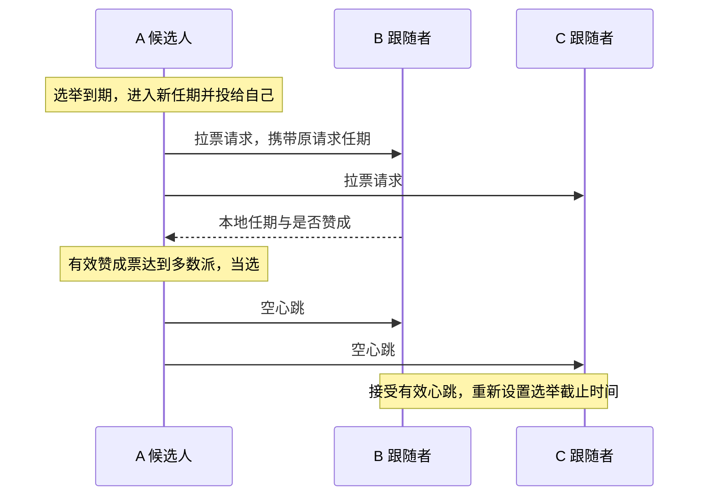

# Raft 核心实现与学习项目

这是我从零学习 Go 并逐步实现 Raft 的项目，目标覆盖 MIT 6.5840 2026 Lab 3A～3D 的选举、日志复制、持久化和快照。当前已完成 3A 和 3B 的实现，官方3A、3B与20个辅助测试的最新 -race 联合回归全部通过；结果见测试记录。下一阶段是 3C 持久化。

本公开目录保存项目说明和复习文档，不包含实验源码；完整代码位于同级 project 目录，供本地和私有仓库使用。原来的 C++ 练习继续保留。[MIT 协作政策](https://pdos.csail.mit.edu/6.824/labs/collab.html)要求含实验实现的 GitHub 仓库设为私有。

## 1. 当前完成到哪里

Lab 3A 的目标是：正常网络中选出领导者并保持稳定；旧领导者断网后，仍能通信的多数派选出新领导者。我已在原目录运行官方 3A 测试并报告通过；整理后的独立版本也已验证，记录见 [测试记录](docs/verification.md)。

| 阶段 | 内容 | 当前状态 |
| --- | --- | --- |
| 3A | 任期、投票、选举、心跳与后台计时 | 已实现，验收结果见测试记录 |
| 3B | 日志复制、冲突修复、多数派提交与顺序交付 | 已实现，官方 3B 通过；最新回归见测试记录 |
| 3C | 任期、投票和日志的保存与恢复 | 未实现 |
| 3D | 快照与日志压缩 | 未实现 |

3A、3B 覆盖选举与内存中的日志共识；3C 持久化和 3D 快照尚未实现，不能据此声称完成崩溃恢复、生产级 Raft 或容错 KV 服务。

## 项目目标与阶段记录

项目目标是逐步完成 MIT 6.5840 Lab 3A～3D 对应的 Raft 核心实现，并积累可复现的故障测试、Go 并发调试与协议解释能力。3A 是第一个已验收阶段，不是项目终点。

### 与参考简历中的 Raft 能力对应

| 参考简历描述 | 本项目对应工作 | 完成证据 |
| --- | --- | --- |
| Leader 选举、网络可靠时快速选出 Leader | 3A：投票、任期、随机超时、心跳和网络故障后的重新选举 | 官方 3A 测试与针对性故障测试 |
| 日志复制并达成共识 | 3B：日志前缀检查、冲突修复、追赶、多数派提交与顺序应用 | 官方 3B 测试；说明保存、提交和应用的区别 |
| 持久化 Raft 状态和日志，宕机后恢复 | 3C：保存并恢复任期、投票与日志，覆盖重启故障 | 官方 3C 测试与崩溃恢复场景；实验保存容器不能冒称生产磁盘引擎 |
| 快照缩减日志，落后节点恢复 | 3D：快照边界、日志索引偏移、快照安装与重启恢复 | 官方 3D 测试与快照故障场景 |
| 大量运行测试，无不一致错误 | 后续保存测试脚本、运行次数、失败记录和执行环境 | 以实际运行记录为准，不沿用参考简历中的 20,000 次数字 |
| Go 并发编程和调试经验 | 在各阶段掌握互斥锁、协程、消息关联、锁外通信和竞争检测 | 能解释实际代码和故障时间线，并通过并发检查 |

参考图片还包含 MapReduce 与其他课程内容；它们不自动加入本 Raft 项目的任务范围。Lab 3A～3D 不包含动态成员变更，完成后也不能直接声称生产级 Raft 或完整分布式 KV 服务。

### 已完成的阶段

| 日期 | 阶段 | 验收与贡献说明 |
| --- | --- | --- |
| 2026-10-04 | 完成 3A：领导者选举与心跳 | 原目录自行运行测试并报告通过；整理版再次通过三个官方 3A 测试及 11 组辅助测试，开启 -race。Go 语法、接口、部分发送函数和测试由 Codex 辅助；不是全部源码均独立编写。 |
| 2026-10-04 | 完成 3B：日志复制、冲突修复、提交与顺序交付 | 学习者在指导下编写核心逻辑，自行运行官方基础一致性与全部 3B，报告 PASS，完整 3B 包耗时 74.452s。Codex 提供注释、Go 语法讲解、局部修正方向和辅助测试；最新回归结果见 docs/verification.md。 |

下一阶段是 3C：持久化与重启恢复。继续由学习者编写核心逻辑；默认由学习者运行测试，助手提供命令和结果分析，明确授权代跑时例外。

## 2. 文件怎样分工

公开目录仅包含文档；完整私有项目中主要复习 `src/raft1/raft.go`，其余文件是运行官方测试所必需的依赖。

| 私有版路径 | 来源与作用 |
| --- | --- |
| `src/raft1/raft.go` | 在官方骨架上练习实现的 Raft 节点，包含中文说明 |
| `src/raft1/guided_state_test.go` | Codex 辅助编写的针对性 Go 测试 |
| `src/raft1/guided_log_test.go` | Codex 编写的 9 个 3B 辅助测试，检查局部行为与边界 |
| `src/raft1/raft_test.go` | MIT 官方实验测试，包含 3A～3D；当前验收 3A、3B |
| `src/raft1/test.go`、`server.go`、`proxy.go`、`util.go` | 官方测试封装与节点运行支持 |
| `src/raftapi/` | 测试器和服务层要求 Raft 提供的接口 |
| `src/labrpc/` | 官方模拟网络，可延迟、丢失请求或回复 |
| `src/labgob/` | 官方编码支持，供通信与后续持久化使用 |
| `src/tester1/`、`src/models1/` | 官方测试器、保存容器及测试模型 |
| `src/main/raft1d.go` | 官方测试所需的节点进程入口 |
| `src/go.mod`、`src/go.sum` | Go 模块与依赖信息，保留官方模块名以维持导入路径 |
| 根目录 `Makefile` | 整理版新增的构建和测试入口 |

测试依赖不能当作自己的实现贡献，但为了复现官方测试，私有版也不能只留下一个 `raft.go`。

## 3. 先读懂代码中的英文

| 英文 | 中文含义 |
| --- | --- |
| Raft / peer | 协议 / 集群中的节点 |
| Follower | 跟随者，等待有效领导者消息 |
| Candidate | 候选人，正在拉票 |
| Leader | 领导者，组织复制并定期发送心跳 |
| term | 任期，选举轮次使用的递增编号 |
| vote / votedFor | 选票 / 本任期投给谁 |
| request / reply / response | 请求 / 回复 / 响应 |
| args | 参数，在这里主要指消息正文 |
| From / To | 发送者编号 / 接收者编号 |
| heartbeat | 心跳，3A 中是空的日志追加请求 |
| electionDeadline | 选举截止时刻，简称 lim |
| reset / send / handle | 重新设置 / 发送 / 处理 |
| Locked | 调用者已经持锁，该辅助函数不能再次获取同一把锁 |

## 4. 类型和结构体：各自存什么

Go 中这里使用结构体及方法，没有额外设计一个 C++ 风格的 class。一个 `Raft` 对象表示一个节点，不是整个集群；使用 `*Raft` 让方法操作同一对象，避免复制节点状态和互斥锁。

| 类型 | 用途 | 关键字段 |
| --- | --- | --- |
| `LogEntry` | 一条日志，位置由切片下标表示 | `Term` 是产生任期，`Command` 是交给服务层的命令 |
| `Role` | 表示节点当前身份，底层是整数 | `Follower`、`Candidate`、`Leader` 三个常量 |
| `Raft` | 保存本节点的配置与状态 | 见下表 |
| `RequestVoteArgs` | 拉票请求正文 | `Term`、`CandidateId`、`LastLogIndex`、`LastLogTerm` |
| `RequestVoteReply` | 接收者作出的拉票回复 | `Term`、`VoteGranted` |
| `VoteRequestMessage` | 待发送请求的本地信封 | `From`、`To`、`Args` |
| `VoteReplyMessage` | 将原请求信息与实际回复关联 | `From`、`To`、`RequestTerm`、`Resp` |
| `AppendEntriesArgs` | 日志复制或空心跳正文 | `Term`、`LeaderId`、`PrevLogIndex`、`PrevLogTerm`、`Entries`、`LeaderCommit` |
| `AppendEntriesReply` | 本次日志请求的答复 | `Term`、`Success`；不代表已经提交 |

`Raft` 中的字段：

| 字段 | 用途 |
| --- | --- |
| `mu` | 互斥锁，保护可能被多个协程同时访问的状态 |
| `peers` | 固定集群的通信端点，包含自己，断网不改变人数 |
| `me` | 本节点在 peers 中的下标 |
| `persister` | 官方保存容器，3C 再实现实际保存逻辑 |
| `currentTerm` | 本节点目前知道的最大任期 |
| `votedFor` | 本任期投给的候选人编号；-1 表示未投票 |
| `role` | 当前身份 |
| `votes` | 本轮已收到的赞成票，按节点编号去重 |
| `electionDeadline` | 跟随者或候选人下一次可以发起选举的截止时刻 |
| `log` | 本地日志，位置0为哨兵，真实命令从1开始 |
| `commitIndex` | 本节点已知的已提交前缀末尾 |
| `lastApplied` | 已按顺序交付给服务层的最后位置 |
| `applyCh` | 交付 `ApplyMsg` 的通道，发送时不持锁 |
| `nextIndex` | 领导者下一次给各节点发送日志的起点 |
| `matchIndex` | 领导者已确认各节点复制到的位置 |

心跳计划时刻 `nextHeartbeat` 是 ticker 的局部变量；它控制发送间隔，不是选举截止时间。投票现在比较真实日志末尾：先任期，后位置；只有哨兵时末尾为 (0, 0)。

## 5. 全部函数的中文用途

下表覆盖当前实现中 `raft.go` 中的全部函数，包括已实现函数与后续阶段的占位接口。

| 函数 | 谁使用、负责什么 | 返回或结果 | 锁的约定 |
| --- | --- | --- | --- |
| `Make` | 初始化状态、哨兵日志和通道，启动计时与应用协程 | 返回节点接口 | 在启动协程前完成初始化 |
| `GetState` | 测试器或服务层查询当前状态 | 当前任期、是否为领导者 | 自行加锁 |
| `majority` | 选举和计票逻辑计算固定集群多数派门槛 | 严格过半的最低票数 | 只读取初始化后固定的配置 |
| `observeHigherTermLocked` | 请求或回复处理逻辑发现更高任期后更新状态并退位 | 清除旧任期投票和计票；非更高任期不修改 | 调用者持锁 |
| `onElectionTimeoutLocked` | 开启选举时完成本地身份转换 | 任期递增、成为候选人、投给自己 | 调用者持锁 |
| `startElection` | 未持锁的调用者或辅助测试发起选举 | 待发送的拉票消息切片 | 自行加锁，再调用持锁版本 |
| `startElectionLocked` | 后台循环在锁内确认超时后发起选举 | 初始化本轮计票，生成请求；单节点可当选 | 调用者持锁 |
| `RequestVote` | 其他候选人通过 RPC 向本节点拉票 | 在 reply 中填写任期和是否赞成 | 自行加锁 |
| `sendRequestVote` | 发送逻辑向一个指定节点拉票 | 通信是否成功，实际回复写入参数 | 网络等待时不持锁 |
| `sendVoteRequests` | 将一组已经准备好的拉票请求并发发送 | 每个回复关联原请求后交给计票函数 | 网络等待时不持锁 |
| `handleRequestVoteResp` | 收到拉票回复后检查任期、竞选身份并计票 | 更高任期退位，多数票当选 | 自行加锁 |
| `AppendEntries` | 核对任期与前置日志，补齐或修复日志后缀，更新本机提交位置 | 回复任期和是否接受，不等于已应用 | 自行加锁 |
| `sendHeartbeats` | 分别按各节点进度发送日志或空心跳，名称沿用 3A | 将原请求与回复交给进度处理函数 | 锁内准备，锁外发送 |
| `resetElectionDeadlineLocked` | 需要重新等待时设定新的截止时刻 | 当前时刻之后随机 500～799 ms | 调用者持锁，或初始化时尚无并发 |
| `ticker` | 后台循环根据身份检查选举与心跳时间 | 选举到期生成请求；心跳到期安排发送 | 锁内判断更新，锁外发送和休眠 |
| `Start` | 领导者接受命令，追加本地日志并检查提交条件 | 返回位置、任期、是否为领导者；不保证最终提交 | 自行加锁 |
| `becomeLeaderLocked` | 切换为领导者，重建本任期复制进度 | 初始化 nextIndex、matchIndex | 调用者持锁 |
| `buildAppendEntriesLocked` | 按指定节点发送起点打包日志请求 | 含独立条目数组的请求；起点到末尾时为空心跳 | 调用者持锁 |
| `handleAppendEntriesReply` | 关联原请求与回复，处理任期、推进或回退复制进度 | 成功后检查多数派提交，忽略过时回复 | 自行加锁 |
| `advanceCommitIndexLocked` | 找出当前任期已达多数派的最远位置 | 推进 commitIndex，旧前缀随之提交 | 调用者持锁 |
| `applier` | 唯一应用协程，按位置交付已提交命令 | 经 applyCh 发送，再推进 lastApplied | 锁内取消息，锁外发送，锁内记录 |
| `persist` | 3C 在任期、投票或日志变化后保存状态 | 编码后交给保存容器；当前占位 | 计划由持锁调用者使用 |
| `readPersist` | 3C 创建节点时恢复先前保存的数据 | 恢复任期、投票和日志；当前占位 | 计划在启动后台任务前执行 |
| `PersistBytes` | 查询已保存状态的大小 | 当前占位返回值，不代表真实保存大小 | 后续实现时保护访问 |
| `Snapshot` | 3D 接收服务层快照并压缩日志 | 当前占位 | 当前未实现 |

## 6. 正常消息时间线



发送函数的通信成功不等于投票成功：RPC 收到明确拒绝也可以正常返回。请求与回复通过网络传内容，不共享对方的结构体指针。

## 7. 两个任期不能混淆

`RequestTerm` 是发送者当初发出请求的任期，`Resp.Term` 是接收者处理请求时知道的任期。前者由发送端保留，不需要接收者额外返回。

例子：A 在任期 3 发出拉票请求，随后超时进入任期 4，旧回复才到。它仍属于任期 3，不能计入任期 4；但若旧回复中携带任期 5，A 必须承认更高任期并退位。因此先检查更高任期，再检查旧轮票是否应忽略。

## 8. 什么时候重置 lim

每次重置都是“当前时刻 + 新随机等待长度”，覆盖旧值，不在旧截止时间上累加。记忆方式是：启动先等，竞选再等，投票让他选，心跳跟他走。

| 事件 | 重置选举截止时间吗 |
| --- | --- |
| 初始化节点 | 是 |
| 开启新一轮选举 | 是，给新一轮完整等待时间 |
| 同意投给某个候选人，包括同候选人的重复请求 | 是 |
| 收到当前或更高任期的领导者日志请求/心跳，即使前置日志不匹配 | 是 |
| 拒绝竞争候选人或旧任期请求 | 否 |
| 收到旧任期心跳 | 否 |
| 收到别人投给自己的回复 | 否，继续等本轮原截止时间或当选 |
| 单纯发现更高任期 | 辅助函数本身不重置，取决于所在路径是否授予投票或收到有效任期的领导者请求 |

## 9. 后台循环、锁和两个闹钟

Leader 检查心跳发送时间，到期发消息，仍保持 Leader；Follower 检查选举截止时间，到期成为 Candidate；Candidate 到期则进入更高任期重试。心跳发送失败不会自动让当前实现中的 Leader 退位，它在发现更高任期时才退位。

循环每轮末尾休眠约 20 ms，心跳轮次至少间隔约 100 ms，选举等待随机 500～799 ms。这些是当前实验实现参数，不是所有 Raft 系统必须使用的固定常数。

检查选举超时和开启新一轮选举在同一把锁内完成。否则“检查到期 → 解锁 → 收到有效心跳并延期 → 仍按旧判断选举”的时间线会造成不必要选举。网络等待放在锁外；Go 的互斥锁不能重复获取，名字带 Locked 的辅助函数约定调用者已经持锁。

## 10. 如何运行完整私有版

完整整理版保留官方模块名 `6.5840`，不需要为 GitHub 仓库改名而改动所有导入路径，也不需要更改协议接口。Windows 下使用 WSL，因为官方测试依赖节点进程和 Unix socket。

在私有版目录中执行：

```bash
make test
make test-guided
```

`make test` 先构建官方节点启动程序，再运行带 `-race` 的官方 3A 测试；`make test-guided` 运行辅助测试。官方测试包含 `TestInitialElection3A`、`TestReElection3A` 和 `TestManyElections3A`。测试是有限场景的证据，不等于协议形式化证明。

旧 `cpp-raft` 和 `cpp-lab3` 是独立 C++ 练习，它们的测试结果不能计为 MIT 官方 Go 测试通过。本次整理没有移动或删除它们。

## 11. GitHub 与代码来源

官方仓库的 origin 是 MIT 的上游地址，不是自己的 GitHub。公开笔记版采用独立 Git 仓库，不携带原项目的 .git 和历史；不会把整个混杂的学习工作区上传。发布与面试官访问方式见 [GitHub 说明](docs/github.md)。完整实验代码可以另建私有仓库保存。

对外描述应使用“基于 MIT 官方骨架完成 Lab 3A/3B 的选举、日志复制、冲突修复、提交与顺序交付，包含 Go 语法和测试辅助”，不要将官方测试器、通信库或者辅助完成部分描述为完全独立开发。参考来源见 [来源说明](docs/sources.md)。


## 12. 3B 完整链路与复习顺序

先读 `LogEntry` 和 `Start`，再读 `buildAppendEntriesLocked`、`sendHeartbeats`、接收端 `AppendEntries`，最后读复制回复、提交判断和 `applier`。一轮命令的流程是：本地接受 → 请求打包 → 网络复制 → 接收者核对与修复 → 发送者确认进度 → 多数派提交 → 按位置交付。

三节点例子：A 在任期5接受命令，放到位置2；B复制成功后回复，A确认B复制到2。A自己加B构成多数派，且位置2产生于当前任期，A把提交位置推进到2。之后A通过请求告诉B已提交到2，B更新自己已知的提交位置；各节点的应用协程独立按顺序交付。C暂时断网不妨碍多数派提交，恢复后再通过前置核对、回退发送起点和后缀复制追赶。

必须分清四个状态：有本地副本、达到提交条件、本节点知道已提交、本节点已经交付。成功 RPC 不等于日志被接受；成功复制不等于多数派提交；领导者已提交不等于所有跟随者都已获知；消息已交付不等于 Raft 收到了业务执行完成确认。

## 13. 两天真实提问与理解确认（3A～3B）

以下按本窗口原消息顺序整理。每条“原话”均逐字摘自学习者消息，只截取与技术疑问有关的连续片段；答案是整理后的解释。明确表达不理解、提出类比或确认理解的消息也保留，并注明其上下文。未主动提出的知识点、代码检查中发现的错误，不改写成学习者问题；测试、发布和教学约定不放进本节。

### 1. 原话

> 按理说raft是一个结构体 那rf不应该数据类型就是raft吗 为啥是指针

`Raft`是类型，`rf`是接收者变量，`*Raft`是指向节点的指针。方法要修改原节点，并与后台协程操作同一个对象；值接收者会复制字段，互斥锁尤其不能复制。Go允许通过结构体指针直接写`rf.role`。

### 2. 原话

> 继续 你这个意思就是vector<int> ans
> 然后ans.emplace_back 对吧

追加单个消息时效果类似，但Go的append返回切片，必须赋回原变量。切片容量不足时可能更换底层数组，所以不能只调用append而丢掉返回值。

### 3. 原话

> 那你这里能不能直接写if reply.Resp.Term != rf.currentTerm {

当时投票回复的写法可以这样合并：任期不同时，调用仅处理更高任期的辅助函数，再返回。回复较高时更新任期并退位，较低时辅助函数不改状态；后面再处理同任期的票。

### 4. 原话

> 你这里往ans里填充requesterm了吗 这个到底代表啥

发出去的投票请求已有Args.Term，不需要另加RequestTerm。发送协程保留原请求，收到答复后把Args.Term放入本地VoteReplyMessage.RequestTerm，用于防止旧轮答复混入新轮计票。

### 5. 原话

> 也就是说 比方说candidate a 发给 follower b 投票请求 那么b的回复不光要有b这一时刻的term还要有a发信息时候的term 是吗

处理答复确实需要两个任期，但B不需要把A发送时的任期额外传回来。B回答处理时的本地任期，A自己保留发送时的任期。A任期3的请求迟到到任期4，不能再计票；如果答复带来任期5，仍必须先承认更高任期。

### 6. 原话

> 我没懂你这里的args和reply都是啥

args是输入请求，接收端读取它；reply是输出答复容器，接收端修改其字段。通过指针填写reply，调用框架才能取得结果。跨节点传递的是消息内容，不是共享对方的内存指针。

### 7. 原话

> 这个意思是 candidate需要跟别人说 让别人处理你发过去的拉票请求？然后你的拉票请求就是args reply是你想接受的答案

候选人通过RPC请求目标节点执行RequestVote处理函数；args是请求正文。reply不是自己想要的答案，而是对方根据任期、投票记录、日志新旧填写的真实答复，可能拒绝。

### 8. 原话

> vote是啥 request是啥 这里最基本的英文我都没懂 导致你写的我都看不懂

vote是投票，request是请求，reply/response是回复，args是参数。RequestVote就是请求投票。先理解中文职责，再对应英文名，不能跳过词义直接讲实现。

### 9. 原话

> 哦 这个就是现在有一串需要发送的信息 我取出来一个个让他们在后台发 如果成功了就包装好 发给计票函数

这是当时对发送流程的理解确认：遍历待发送消息，每个目标使用独立协程，通信成功后包装答复与原请求信息，交给计票函数。通信成功只表示收到回复，是否赞成仍看VoteGranted；一个目标通信失败只结束其发送协程。

### 10. 原话

> 也就是说你这个操作相当于设定了一个limit 然后接到合法的回复之后就更新这个limit 是累加 而不是重置 我说的可对

不是累加旧截止时间，而是每次用当前时刻加新的随机等待长度覆盖它。初始化、开始竞选、同意投票、收到当前或更高任期的领导者请求时重新等待；投票回复本身不会重置选举计时。

### 11. 原话

> 你帮我补 然后给我讲明白什么时候要重置lim 带我记住

记忆方式是：启动先等，竞选再等，投票让他选，领导者消息跟他走。旧任期请求不重置；发现更高任期的辅助函数本身也不重置，要看所在路径是否授票或收到有效任期领导者请求。3B中前置日志核对失败仍说明领导者在联系，所以也重置。

### 12. 原话

> 也就是说你这个函数相当于 向所有节点发送空心跳 其实最直白的就是 for (auto p : peers) if (p == cur) continue; term = max(term, p.term) 差不多就这意思是不是 只是你加了锁啥的

遍历其他节点发送这一点相似，但peers是通信端点，不能直接读取远程节点的term。要发RPC、等待对方回复，从回复发现更高任期后再持锁更新状态；锁只能保护本机状态，不会锁住远程节点。3B里的发送函数已进一步扩展为按节点进度发送日志或空心跳。

### 13. 原话

> 意思是 这个ticker就会在后台一直执行判断 然后每隔20ms就check一下 根据当前身份决定有没有超时 以及超时之后需要怎么做 对于ld 超时之后应该变成candidate开始投票 如果是别的那如果到期了就说明要开始变成candidate 吗 我没懂这个逻辑

领导者检查发送闹钟，到期发日志或心跳，身份不变；跟随者与候选人检查选举截止时间，到期进入新任期竞选。当前实现中的领导者不因单次发送失败自动退位，发现更高任期才退位。两个闹钟用途不同。

### 14. 原话

> 哦哦我懂了 也就是你只写了个while 他自己没有等待20ms的效果 还得你自己加 这不卡了

这是当时对循环等待的理解确认：无限循环不会自动按20ms执行，需要显式休眠。time.Duration的基础单位是纳秒，毫秒必须显式乘time.Millisecond；休眠放在解锁后，避免忙等和占锁等待。

### 15. 原话

> 我有点没懂 第一次进入9. 的时候 说明刚好匹配上前缀对吧 那我只需要把ars的后缀接到rf的前缀不就行 了  遍历的意义是

连接点核对成功不代表它之后的本地日志都应删掉。A先发携带b的请求①，再发携带b、c的请求②；B先收②、后收迟到①。直接截断再接b会误删正确的c，所以遍历时跳过已有匹配条目，仅在缺失或首次冲突处追加或替换后缀；空请求不删除日志。

### 16. 原话

> 没懂这句话是啥意思 解释完之后直接开启下一个

这条原话针对前文“args.Entries[i:]是切片，需要用...展开”的解释。切片与单个元素是不同类型：整数切片b不能当一个int追加到整数切片a。append(a,b...)把b的每个元素加入a，效果类似C++区间insert；这不是添加嵌套容器。

### 17. 原话

> 一个决定自己下一次给节点i发送从哪里开始 一个决定节点i已经复制到哪是吧 match是啥意思 反正这俩我已经弄好了  解释完就继续

nextIndex[i]是下次给节点i发送的起点；matchIndex[i]是领导者已通过成功答复确认它复制到的位置。match是匹配，index是位置。节点可能实际收到更多，但回复尚未到达时不能算作领导者已确认。

### 18. 原话

> 看看有问题没有 这个意思就是初始化一个ld吧 然后这个nxtidx有可能会不断--对不对

becomeLeaderLocked在每次当选时重建本任期复制进度，两个当选入口都要调用。前置不匹配的有效失败可让nextIndex向前退，成功则推进；通信失败不回退，过时失败不回退。当前没有快照，发送起点最低1，位置0是哨兵。

### 19. 原话

> 是啥意思 你这个for难道不可以直接遍历rf.nxtidx数组的东西吗

可以遍历元素，但range取得的元素是副本，修改副本不会写回原切片，相当于C++ auto x而非auto &x。单变量range取得下标，双变量取得下标与元素副本；要修改元素，用下标写回，普通下标for也可以。

### 20. 原话

> 我没懂这里为啥有这个 reply也是一个参数吗 这个函数不是处理添加日志回复的函数吗 为什么有reply 那message是啥 我知道了 是不是msg是我们发过去的信息 他原封不动传回来了 然后rply是他的回复

message是本机保留的原请求，不是对方传回的副本；reply才是对方答复。原请求用于识别任期并计算成功确认的位置，回复用于判断任期与成功。先处理更高回复任期，再排除非领导者、旧请求和不同任期答复，才能更新本轮复制进度。

### 21. 原话

> 这就是个二分呗

当前代码是从后往前枚举，寻找最远的可提交位置，每个位置统计复制节点数。它还要求条目属于当前任期，不能忽略这个限制直接套普通二分。后续可研究多数派复制边界优化，当前实现优先直接验证规则。

### 22. 原话

> 没看懂你这一轮到底想写什么

这条原话发生在advanceCommitIndexLocked任务之后。函数要回答哪些日志满足当前任期多数派条件，推进commitIndex，不发送消息也不执行命令。自己计一份，再数其他节点中matchIndex达到该位置的数量；足够才提交，旧前缀随当前任期条目一起提交。

### 23. 原话

> 这个lstapplied是说上一次以应用的 然后提交和应用是不一样的 所以要for i = lstapp + 1; i <= cmtidx; i++ 逐个应用对吗

待交付范围确实是lastApplied+1到commitIndex。commitIndex记录本节点知道已提交到哪里，lastApplied记录已按顺序交付到哪里。唯一应用协程逐条取消息、解锁发送、完成后记录进度；本实现记录的是通道交付，不是服务层另行确认业务执行完成。

### 24. 原话

> 写的差不多了 但是我没懂这里枷锁的意义在哪

这条原话针对applier。它读取的commitIndex和log可能同时被RPC或其他协程更新，因此判断、选位置和构造消息必须在同一把锁内完成。发送通道可能等待接收，必须解锁；发送后再持锁记录lastApplied。锁保护本机并发访问，不能替代已提交日志不改写的协议规则。

### 25. 原话

> 给我讲下raft的共享状态都有哪些

本机可变共享字段包括currentTerm、votedFor、role、votes、electionDeadline、log、commitIndex、nextIndex、matchIndex和lastApplied。读写都遵守mu约定。me、peers、applyCh和persister引用初始化后固定，可直接读取；通道本身支持并发通信。不同节点不共用一份Raft内存。

### 26. 原话

> 反正就是我要用到rf.的值的时候就上个锁 以防被修改是吧

更准确地说，访问可能被其他协程修改的状态时持锁，固定配置字段不用每次锁。相关操作要作为一组放在同一次加锁内，不能读一个字段锁一次。网络、通道和休眠在锁外进行；Locked辅助函数不再次加锁，循环中的defer也不会每轮执行。

## 14. 3A/3B 复现命令与下一阶段

在 PowerShell 中执行（需要 WSL Ubuntu-24.04）：

```powershell
# 官方基础一致性
wsl -d Ubuntu-24.04 -- bash -lc 'cd /mnt/d/Desktop/Raft/project && make build && cd src/raft1 && go test -v -race -run "^TestBasicAgree3B$" -count=1 -timeout=120s'
# 官方完整 3A、3B 回归
wsl -d Ubuntu-24.04 -- bash -lc 'cd /mnt/d/Desktop/Raft/project && make build && cd src/raft1 && go test -v -race -run "3A|3B" -count=1 -timeout=300s'
# 自编辅助 Go 测试，不能替代官方验收
wsl -d Ubuntu-24.04 -- bash -lc 'cd /mnt/d/Desktop/Raft/project/src && go test -v -race ./raft1 -run "^TestGuided" -count=1 -timeout=60s'
```

下一次从同一个 raft.go 的 persist、readPersist 与 Make 恢复路径开始规划3C。先理解需要跨重启保留的 currentTerm、votedFor、log，再决定编码、保存时机和恢复顺序；不要把尚未实现的持久化写成已完成。
