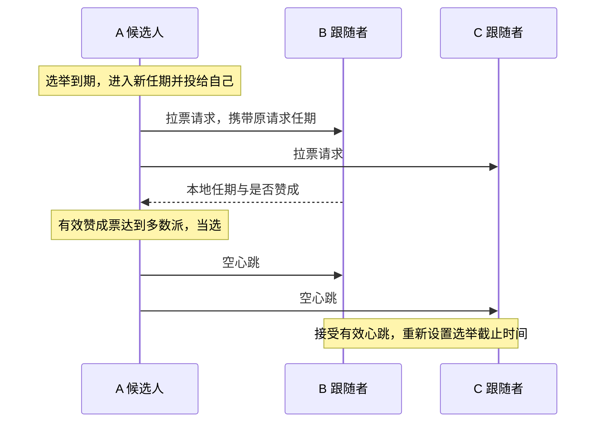

# Raft 3A 中文学习笔记

这是我学习 MIT 6.5840 2026 Lab 3A 的复习仓库。当前阶段是领导者选举与空心跳，还没有实现日志复制、持久化或快照。学习过程中由我练习状态转换和选举逻辑，Codex 协助讲解 Go 语法、接口、并发发送以及测试；不把辅助完成的部分描述为独立实现。

本公开仓库保存概念、结构和函数用途，不包含 MIT 实验答案与官方测试代码。完整代码和可运行测试保存在本地独立目录 `raft-study-private`；原来的 C++ 练习也继续保留。[MIT 协作政策](https://pdos.csail.mit.edu/6.824/labs/collab.html)要求含实验实现的 GitHub 仓库设为私有。

## 1. 当前完成到哪里

Lab 3A 的目标是：正常网络中选出领导者并保持稳定；旧领导者断网后，仍能通信的多数派选出新领导者。用户已在原目录运行官方 3A 测试并报告通过；整理后的独立版本会单独验证，记录见 [测试记录](docs/verification.md)。

| 阶段 | 内容 | 当前状态 |
| --- | --- | --- |
| 3A | 任期、投票、选举、心跳与后台计时 | 已实现，验收结果见测试记录 |
| 3B | 日志复制、冲突修复与提交应用 | 未实现 |
| 3C | 任期、投票和日志的保存与恢复 | 未实现 |
| 3D | 快照与日志压缩 | 未实现 |

只通过 3A 不能说明已经完成 Raft 共识、崩溃恢复或容错 KV 服务。

## 2. 文件怎样分工

公开版只需要阅读本 README 和 docs。完整私有整理版中，主要复习 `src/raft1/raft.go`，其余文件是运行官方测试所必需的依赖。

| 私有版路径 | 来源与作用 |
| --- | --- |
| `src/raft1/raft.go` | 在官方骨架上练习实现的 Raft 节点，包含中文说明 |
| `src/raft1/guided_state_test.go` | Codex 辅助编写的针对性 Go 测试 |
| `src/raft1/raft_test.go` | MIT 官方实验测试，包含 3A～3D；当前只跑 3A |
| `src/raft1/test.go`、`server.go`、`proxy.go`、`util.go` | 官方测试封装与节点运行支持 |
| `src/raftapi/` | 测试器和服务层要求 Raft 提供的接口 |
| `src/labrpc/` | 官方模拟网络，可延迟、丢失请求或回复 |
| `src/labgob/` | 官方编码支持，供通信与后续持久化使用 |
| `src/tester1/`、`src/models1/` | 官方测试器、保存容器及测试模型 |
| `src/main/raft1d.go` | 官方测试所需的节点进程入口 |
| `src/go.mod`、`src/go.sum` | Go 模块与依赖信息，保留官方模块名以维持导入路径 |
| 根目录 `Makefile` | 整理版新增的构建和测试入口 |

测试依赖不能当作自己的实现贡献，但为了复现官方测试，私有版也不能只留下一个 `raft.go`。

## 3. 先读懂代码中的英文

| 英文 | 中文含义 |
| --- | --- |
| Raft / peer | 协议 / 集群中的节点 |
| Follower | 跟随者，等待有效领导者消息 |
| Candidate | 候选人，正在拉票 |
| Leader | 领导者，组织复制并定期发送心跳 |
| term | 任期，选举轮次使用的递增编号 |
| vote / votedFor | 选票 / 本任期投给谁 |
| request / reply / response | 请求 / 回复 / 响应 |
| args | 参数，在这里主要指消息正文 |
| From / To | 发送者编号 / 接收者编号 |
| heartbeat | 心跳，3A 中是空的日志追加请求 |
| electionDeadline | 选举截止时刻，简称 lim |
| reset / send / handle | 重新设置 / 发送 / 处理 |
| Locked | 调用者已经持锁，该辅助函数不能再次获取同一把锁 |

## 4. 类型和结构体：各自存什么

Go 中这里使用结构体及方法，没有额外设计一个 C++ 风格的 class。一个 `Raft` 对象表示一个节点，不是整个集群；使用 `*Raft` 让方法操作同一对象，避免复制节点状态和互斥锁。

| 类型 | 用途 | 关键字段 |
| --- | --- | --- |
| `Role` | 表示节点当前身份，底层是整数 | `Follower`、`Candidate`、`Leader` 三个常量 |
| `Raft` | 保存本节点的配置与状态 | 见下表 |
| `RequestVoteArgs` | 拉票请求正文 | `Term`、`CandidateId`、`LastLogIndex`、`LastLogTerm` |
| `RequestVoteReply` | 接收者作出的拉票回复 | `Term`、`VoteGranted` |
| `VoteRequestMessage` | 待发送请求的本地信封 | `From`、`To`、`Args` |
| `VoteReplyMessage` | 将原请求信息与实际回复关联 | `From`、`To`、`RequestTerm`、`Resp` |
| `AppendEntriesArgs` | 当前 3A 的空心跳正文 | `Term`、`LeaderId` |
| `AppendEntriesReply` | 当前心跳回复 | `Term`、`Success` |

`Raft` 中的字段：

| 字段 | 用途 |
| --- | --- |
| `mu` | 互斥锁，保护可能被多个协程同时访问的状态 |
| `peers` | 固定集群的通信端点，包含自己，断网不改变人数 |
| `me` | 本节点在 peers 中的下标 |
| `persister` | 官方保存容器，3C 再实现实际保存逻辑 |
| `currentTerm` | 本节点目前知道的最大任期 |
| `votedFor` | 本任期投给的候选人编号；-1 表示未投票 |
| `role` | 当前身份 |
| `votes` | 本轮已收到的赞成票，按节点编号去重 |
| `electionDeadline` | 跟随者或候选人下一次可以发起选举的截止时刻 |

心跳计划时刻 `nextHeartbeat` 是 ticker 的局部变量；它控制发送间隔，不是选举截止时间。3A 的日志末尾暂按空日志处理，不能将这个比较实现当作完整的日志新旧检查。

## 5. 全部函数的中文用途

下表覆盖整理时 `raft.go` 中的全部函数，包括已实现函数与后续阶段的占位接口。

| 函数 | 谁使用、负责什么 | 返回或结果 | 锁的约定 |
| --- | --- | --- | --- |
| `Make` | 测试器创建节点；初始化状态与截止时间，启动后台计时 | 返回节点接口 | 在启动协程前完成初始化 |
| `GetState` | 测试器或服务层查询当前状态 | 当前任期、是否为领导者 | 自行加锁 |
| `majority` | 选举和计票逻辑计算固定集群多数派门槛 | 严格过半的最低票数 | 只读取初始化后固定的配置 |
| `observeHigherTermLocked` | 请求或回复处理逻辑发现更高任期后更新状态并退位 | 清除旧任期投票和计票；非更高任期不修改 | 调用者持锁 |
| `onElectionTimeoutLocked` | 开启选举时完成本地身份转换 | 任期递增、成为候选人、投给自己 | 调用者持锁 |
| `startElection` | 未持锁的调用者或辅助测试发起选举 | 待发送的拉票消息切片 | 自行加锁，再调用持锁版本 |
| `startElectionLocked` | 后台循环在锁内确认超时后发起选举 | 初始化本轮计票，生成请求；单节点可当选 | 调用者持锁 |
| `RequestVote` | 其他候选人通过 RPC 向本节点拉票 | 在 reply 中填写任期和是否赞成 | 自行加锁 |
| `sendRequestVote` | 发送逻辑向一个指定节点拉票 | 通信是否成功，实际回复写入参数 | 网络等待时不持锁 |
| `sendVoteRequests` | 将一组已经准备好的拉票请求并发发送 | 每个回复关联原请求后交给计票函数 | 网络等待时不持锁 |
| `handleRequestVoteResp` | 收到拉票回复后检查任期、竞选身份并计票 | 更高任期退位，多数票当选 | 自行加锁 |
| `AppendEntries` | 接收领导者发来的心跳；3B 再扩展为日志追加 | 在 reply 中填写任期和是否接受 | 自行加锁 |
| `sendHeartbeats` | 后台循环向所有其他节点发送本轮空心跳 | 更高任期回复使发送者退位 | 锁内准备，锁外发送，锁内处理回复 |
| `resetElectionDeadlineLocked` | 需要重新等待时设定新的截止时刻 | 当前时刻之后随机 500～799 ms | 调用者持锁，或初始化时尚无并发 |
| `ticker` | 后台循环根据身份检查选举与心跳时间 | 选举到期生成请求；心跳到期安排发送 | 锁内判断更新，锁外发送和休眠 |
| `Start` | 服务层请求追加新命令，3B 接口 | 计划返回位置、任期和是否为领导者；当前占位 | 当前未实现 |
| `persist` | 3C 在任期、投票或日志变化后保存状态 | 编码后交给保存容器；当前占位 | 计划由持锁调用者使用 |
| `readPersist` | 3C 创建节点时恢复先前保存的数据 | 恢复任期、投票和日志；当前占位 | 计划在启动后台任务前执行 |
| `PersistBytes` | 查询已保存状态的大小 | 当前占位返回值，不代表真实保存大小 | 后续实现时保护访问 |
| `Snapshot` | 3D 接收服务层快照并压缩日志 | 当前占位 | 当前未实现 |

## 6. 正常消息时间线



发送函数的通信成功不等于投票成功：RPC 收到明确拒绝也可以正常返回。请求与回复通过网络传内容，不共享对方的结构体指针。

## 7. 两个任期不能混淆

`RequestTerm` 是发送者当初发出请求的任期，`Resp.Term` 是接收者处理请求时知道的任期。前者由发送端保留，不需要接收者额外返回。

例子：A 在任期 3 发出拉票请求，随后超时进入任期 4，旧回复才到。它仍属于任期 3，不能计入任期 4；但若旧回复中携带任期 5，A 必须承认更高任期并退位。因此先检查更高任期，再检查旧轮票是否应忽略。

## 8. 什么时候重置 lim

每次重置都是“当前时刻 + 新随机等待长度”，覆盖旧值，不在旧截止时间上累加。记忆方式是：启动先等，竞选再等，投票让他选，心跳跟他走。

| 事件 | 重置选举截止时间吗 |
| --- | --- |
| 初始化节点 | 是 |
| 开启新一轮选举 | 是，给新一轮完整等待时间 |
| 同意投给某个候选人，包括同候选人的重复请求 | 是 |
| 接受当前或更高任期的心跳 | 是 |
| 拒绝竞争候选人或旧任期请求 | 否 |
| 收到旧任期心跳 | 否 |
| 收到别人投给自己的回复 | 否，继续等本轮原截止时间或当选 |
| 单纯发现更高任期 | 辅助函数本身不重置，取决于所在路径是否授予投票或接受心跳 |

## 9. 后台循环、锁和两个闹钟

Leader 检查心跳发送时间，到期发消息，仍保持 Leader；Follower 检查选举截止时间，到期成为 Candidate；Candidate 到期则进入更高任期重试。心跳发送失败不会自动让当前实现中的 Leader 退位，它在发现更高任期时才退位。

循环每轮末尾休眠约 20 ms，心跳轮次至少间隔约 100 ms，选举等待随机 500～799 ms。这些是当前实验实现参数，不是所有 Raft 系统必须使用的固定常数。

检查选举超时和开启新一轮选举在同一把锁内完成。否则“检查到期 → 解锁 → 收到有效心跳并延期 → 仍按旧判断选举”的时间线会造成不必要选举。网络等待放在锁外；Go 的互斥锁不能重复获取，名字带 Locked 的辅助函数约定调用者已经持锁。

## 10. 如何运行完整私有版

完整整理版保留官方模块名 `6.5840`，不需要为 GitHub 仓库改名而改动所有导入路径，也不需要更改协议接口。Windows 下使用 WSL，因为官方测试依赖节点进程和 Unix socket。

在私有版目录中执行：

```bash
make test
make test-guided
```

`make test` 先构建官方节点启动程序，再运行带 `-race` 的官方 3A 测试；`make test-guided` 运行辅助测试。官方测试包含 `TestInitialElection3A`、`TestReElection3A` 和 `TestManyElections3A`。测试是有限场景的证据，不等于协议形式化证明。

旧 `cpp-raft` 和 `cpp-lab3` 是独立 C++ 练习，它们的测试结果不能计为 MIT 官方 Go 测试通过。本次整理没有移动或删除它们。

## 11. GitHub 与代码来源

官方仓库的 origin 是 MIT 的上游地址，不是自己的 GitHub。公开笔记版采用独立 Git 仓库，不携带原项目的 .git 和历史；不会把整个混杂的学习工作区上传。发布与面试官访问方式见 [GitHub 说明](docs/github.md)。完整实验代码可以另建私有仓库保存。

对外描述应使用“基于 MIT 官方骨架的 Lab 3A 学习实现，包含 Go 语法和测试辅助”，不要将官方测试器、通信库或者辅助完成部分描述为完全独立开发。参考来源见 [来源说明](docs/sources.md)。
