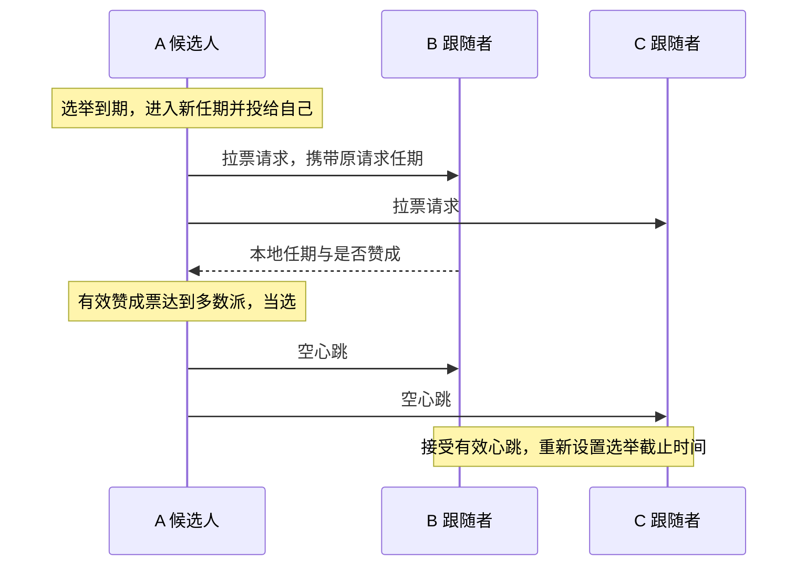

# Raft 核心实现与学习项目

这是我从零学习 Go 并逐步实现 Raft 的项目，目标覆盖 MIT 6.5840 2026 Lab 3A～3D 的选举、日志复制、持久化和快照。当前已完成 3A 和 3B 的实现，官方3A、3B与20个辅助测试的最新 -race 联合回归全部通过；结果见测试记录。下一阶段是 3C 持久化。

本公开目录保存项目说明和复习文档，不包含实验源码；完整代码位于同级 project 目录，供本地和私有仓库使用。原来的 C++ 练习继续保留。[MIT 协作政策](https://pdos.csail.mit.edu/6.824/labs/collab.html)要求含实验实现的 GitHub 仓库设为私有。

## 1. 当前完成到哪里

Lab 3A 的目标是：正常网络中选出领导者并保持稳定；旧领导者断网后，仍能通信的多数派选出新领导者。我已在原目录运行官方 3A 测试并报告通过；整理后的独立版本也已验证，记录见 [测试记录](docs/verification.md)。

| 阶段 | 内容 | 当前状态 |
| --- | --- | --- |
| 3A | 任期、投票、选举、心跳与后台计时 | 已实现，验收结果见测试记录 |
| 3B | 日志复制、冲突修复、多数派提交与顺序交付 | 已实现，官方 3B 通过；最新回归见测试记录 |
| 3C | 任期、投票和日志的保存与恢复 | 未实现 |
| 3D | 快照与日志压缩 | 未实现 |

3A、3B 覆盖选举与内存中的日志共识；3C 持久化和 3D 快照尚未实现，不能据此声称完成崩溃恢复、生产级 Raft 或容错 KV 服务。

## 项目目标与阶段记录

项目目标是逐步完成 MIT 6.5840 Lab 3A～3D 对应的 Raft 核心实现，并积累可复现的故障测试、Go 并发调试与协议解释能力。3A 是第一个已验收阶段，不是项目终点。

### 与参考简历中的 Raft 能力对应

| 参考简历描述 | 本项目对应工作 | 完成证据 |
| --- | --- | --- |
| Leader 选举、网络可靠时快速选出 Leader | 3A：投票、任期、随机超时、心跳和网络故障后的重新选举 | 官方 3A 测试与针对性故障测试 |
| 日志复制并达成共识 | 3B：日志前缀检查、冲突修复、追赶、多数派提交与顺序应用 | 官方 3B 测试；说明保存、提交和应用的区别 |
| 持久化 Raft 状态和日志，宕机后恢复 | 3C：保存并恢复任期、投票与日志，覆盖重启故障 | 官方 3C 测试与崩溃恢复场景；实验保存容器不能冒称生产磁盘引擎 |
| 快照缩减日志，落后节点恢复 | 3D：快照边界、日志索引偏移、快照安装与重启恢复 | 官方 3D 测试与快照故障场景 |
| 大量运行测试，无不一致错误 | 后续保存测试脚本、运行次数、失败记录和执行环境 | 以实际运行记录为准，不沿用参考简历中的 20,000 次数字 |
| Go 并发编程和调试经验 | 在各阶段掌握互斥锁、协程、消息关联、锁外通信和竞争检测 | 能解释实际代码和故障时间线，并通过并发检查 |

参考图片还包含 MapReduce 与其他课程内容；它们不自动加入本 Raft 项目的任务范围。Lab 3A～3D 不包含动态成员变更，完成后也不能直接声称生产级 Raft 或完整分布式 KV 服务。

### 已完成的阶段

| 日期 | 阶段 | 验收与贡献说明 |
| --- | --- | --- |
| 2026-10-04 | 完成 3A：领导者选举与心跳 | 原目录自行运行测试并报告通过；整理版再次通过三个官方 3A 测试及 11 组辅助测试，开启 -race。Go 语法、接口、部分发送函数和测试由 Codex 辅助；不是全部源码均独立编写。 |
| 2026-10-04 | 完成 3B：日志复制、冲突修复、提交与顺序交付 | 学习者在指导下编写核心逻辑，自行运行官方基础一致性与全部 3B，报告 PASS，完整 3B 包耗时 74.452s。Codex 提供注释、Go 语法讲解、局部修正方向和辅助测试；最新回归结果见 docs/verification.md。 |

下一阶段是 3C：持久化与重启恢复。继续由学习者编写核心逻辑；默认由学习者运行测试，助手提供命令和结果分析，明确授权代跑时例外。

## 2. 文件怎样分工

公开目录仅包含文档；完整私有项目中主要复习 `src/raft1/raft.go`，其余文件是运行官方测试所必需的依赖。

| 私有版路径 | 来源与作用 |
| --- | --- |
| `src/raft1/raft.go` | 在官方骨架上练习实现的 Raft 节点，包含中文说明 |
| `src/raft1/guided_state_test.go` | Codex 辅助编写的针对性 Go 测试 |
| `src/raft1/guided_log_test.go` | Codex 编写的 9 个 3B 辅助测试，检查局部行为与边界 |
| `src/raft1/raft_test.go` | MIT 官方实验测试，包含 3A～3D；当前验收 3A、3B |
| `src/raft1/test.go`、`server.go`、`proxy.go`、`util.go` | 官方测试封装与节点运行支持 |
| `src/raftapi/` | 测试器和服务层要求 Raft 提供的接口 |
| `src/labrpc/` | 官方模拟网络，可延迟、丢失请求或回复 |
| `src/labgob/` | 官方编码支持，供通信与后续持久化使用 |
| `src/tester1/`、`src/models1/` | 官方测试器、保存容器及测试模型 |
| `src/main/raft1d.go` | 官方测试所需的节点进程入口 |
| `src/go.mod`、`src/go.sum` | Go 模块与依赖信息，保留官方模块名以维持导入路径 |
| 根目录 `Makefile` | 整理版新增的构建和测试入口 |

测试依赖不能当作自己的实现贡献，但为了复现官方测试，私有版也不能只留下一个 `raft.go`。

## 3. 先读懂代码中的英文

| 英文 | 中文含义 |
| --- | --- |
| Raft / peer | 协议 / 集群中的节点 |
| Follower | 跟随者，等待有效领导者消息 |
| Candidate | 候选人，正在拉票 |
| Leader | 领导者，组织复制并定期发送心跳 |
| term | 任期，选举轮次使用的递增编号 |
| vote / votedFor | 选票 / 本任期投给谁 |
| request / reply / response | 请求 / 回复 / 响应 |
| args | 参数，在这里主要指消息正文 |
| From / To | 发送者编号 / 接收者编号 |
| heartbeat | 心跳，3A 中是空的日志追加请求 |
| electionDeadline | 选举截止时刻，简称 lim |
| reset / send / handle | 重新设置 / 发送 / 处理 |
| Locked | 调用者已经持锁，该辅助函数不能再次获取同一把锁 |

## 4. 类型和结构体：各自存什么

Go 中这里使用结构体及方法，没有额外设计一个 C++ 风格的 class。一个 `Raft` 对象表示一个节点，不是整个集群；使用 `*Raft` 让方法操作同一对象，避免复制节点状态和互斥锁。

| 类型 | 用途 | 关键字段 |
| --- | --- | --- |
| `LogEntry` | 一条日志，位置由切片下标表示 | `Term` 是产生任期，`Command` 是交给服务层的命令 |
| `Role` | 表示节点当前身份，底层是整数 | `Follower`、`Candidate`、`Leader` 三个常量 |
| `Raft` | 保存本节点的配置与状态 | 见下表 |
| `RequestVoteArgs` | 拉票请求正文 | `Term`、`CandidateId`、`LastLogIndex`、`LastLogTerm` |
| `RequestVoteReply` | 接收者作出的拉票回复 | `Term`、`VoteGranted` |
| `VoteRequestMessage` | 待发送请求的本地信封 | `From`、`To`、`Args` |
| `VoteReplyMessage` | 将原请求信息与实际回复关联 | `From`、`To`、`RequestTerm`、`Resp` |
| `AppendEntriesArgs` | 日志复制或空心跳正文 | `Term`、`LeaderId`、`PrevLogIndex`、`PrevLogTerm`、`Entries`、`LeaderCommit` |
| `AppendEntriesReply` | 本次日志请求的答复 | `Term`、`Success`；不代表已经提交 |

`Raft` 中的字段：

| 字段 | 用途 |
| --- | --- |
| `mu` | 互斥锁，保护可能被多个协程同时访问的状态 |
| `peers` | 固定集群的通信端点，包含自己，断网不改变人数 |
| `me` | 本节点在 peers 中的下标 |
| `persister` | 官方保存容器，3C 再实现实际保存逻辑 |
| `currentTerm` | 本节点目前知道的最大任期 |
| `votedFor` | 本任期投给的候选人编号；-1 表示未投票 |
| `role` | 当前身份 |
| `votes` | 本轮已收到的赞成票，按节点编号去重 |
| `electionDeadline` | 跟随者或候选人下一次可以发起选举的截止时刻 |
| `log` | 本地日志，位置0为哨兵，真实命令从1开始 |
| `commitIndex` | 本节点已知的已提交前缀末尾 |
| `lastApplied` | 已按顺序交付给服务层的最后位置 |
| `applyCh` | 交付 `ApplyMsg` 的通道，发送时不持锁 |
| `nextIndex` | 领导者下一次给各节点发送日志的起点 |
| `matchIndex` | 领导者已确认各节点复制到的位置 |

心跳计划时刻 `nextHeartbeat` 是 ticker 的局部变量；它控制发送间隔，不是选举截止时间。投票现在比较真实日志末尾：先任期，后位置；只有哨兵时末尾为 (0, 0)。

## 5. 全部函数的中文用途

下表覆盖当前实现中 `raft.go` 中的全部函数，包括已实现函数与后续阶段的占位接口。

| 函数 | 谁使用、负责什么 | 返回或结果 | 锁的约定 |
| --- | --- | --- | --- |
| `Make` | 初始化状态、哨兵日志和通道，启动计时与应用协程 | 返回节点接口 | 在启动协程前完成初始化 |
| `GetState` | 测试器或服务层查询当前状态 | 当前任期、是否为领导者 | 自行加锁 |
| `majority` | 选举和计票逻辑计算固定集群多数派门槛 | 严格过半的最低票数 | 只读取初始化后固定的配置 |
| `observeHigherTermLocked` | 请求或回复处理逻辑发现更高任期后更新状态并退位 | 清除旧任期投票和计票；非更高任期不修改 | 调用者持锁 |
| `onElectionTimeoutLocked` | 开启选举时完成本地身份转换 | 任期递增、成为候选人、投给自己 | 调用者持锁 |
| `startElection` | 未持锁的调用者或辅助测试发起选举 | 待发送的拉票消息切片 | 自行加锁，再调用持锁版本 |
| `startElectionLocked` | 后台循环在锁内确认超时后发起选举 | 初始化本轮计票，生成请求；单节点可当选 | 调用者持锁 |
| `RequestVote` | 其他候选人通过 RPC 向本节点拉票 | 在 reply 中填写任期和是否赞成 | 自行加锁 |
| `sendRequestVote` | 发送逻辑向一个指定节点拉票 | 通信是否成功，实际回复写入参数 | 网络等待时不持锁 |
| `sendVoteRequests` | 将一组已经准备好的拉票请求并发发送 | 每个回复关联原请求后交给计票函数 | 网络等待时不持锁 |
| `handleRequestVoteResp` | 收到拉票回复后检查任期、竞选身份并计票 | 更高任期退位，多数票当选 | 自行加锁 |
| `AppendEntries` | 核对任期与前置日志，补齐或修复日志后缀，更新本机提交位置 | 回复任期和是否接受，不等于已应用 | 自行加锁 |
| `sendHeartbeats` | 分别按各节点进度发送日志或空心跳，名称沿用 3A | 将原请求与回复交给进度处理函数 | 锁内准备，锁外发送 |
| `resetElectionDeadlineLocked` | 需要重新等待时设定新的截止时刻 | 当前时刻之后随机 500～799 ms | 调用者持锁，或初始化时尚无并发 |
| `ticker` | 后台循环根据身份检查选举与心跳时间 | 选举到期生成请求；心跳到期安排发送 | 锁内判断更新，锁外发送和休眠 |
| `Start` | 领导者接受命令，追加本地日志并检查提交条件 | 返回位置、任期、是否为领导者；不保证最终提交 | 自行加锁 |
| `becomeLeaderLocked` | 切换为领导者，重建本任期复制进度 | 初始化 nextIndex、matchIndex | 调用者持锁 |
| `buildAppendEntriesLocked` | 按指定节点发送起点打包日志请求 | 含独立条目数组的请求；起点到末尾时为空心跳 | 调用者持锁 |
| `handleAppendEntriesReply` | 关联原请求与回复，处理任期、推进或回退复制进度 | 成功后检查多数派提交，忽略过时回复 | 自行加锁 |
| `advanceCommitIndexLocked` | 找出当前任期已达多数派的最远位置 | 推进 commitIndex，旧前缀随之提交 | 调用者持锁 |
| `applier` | 唯一应用协程，按位置交付已提交命令 | 经 applyCh 发送，再推进 lastApplied | 锁内取消息，锁外发送，锁内记录 |
| `persist` | 3C 在任期、投票或日志变化后保存状态 | 编码后交给保存容器；当前占位 | 计划由持锁调用者使用 |
| `readPersist` | 3C 创建节点时恢复先前保存的数据 | 恢复任期、投票和日志；当前占位 | 计划在启动后台任务前执行 |
| `PersistBytes` | 查询已保存状态的大小 | 当前占位返回值，不代表真实保存大小 | 后续实现时保护访问 |
| `Snapshot` | 3D 接收服务层快照并压缩日志 | 当前占位 | 当前未实现 |

## 6. 正常消息时间线



发送函数的通信成功不等于投票成功：RPC 收到明确拒绝也可以正常返回。请求与回复通过网络传内容，不共享对方的结构体指针。

## 7. 两个任期不能混淆

`RequestTerm` 是发送者当初发出请求的任期，`Resp.Term` 是接收者处理请求时知道的任期。前者由发送端保留，不需要接收者额外返回。

例子：A 在任期 3 发出拉票请求，随后超时进入任期 4，旧回复才到。它仍属于任期 3，不能计入任期 4；但若旧回复中携带任期 5，A 必须承认更高任期并退位。因此先检查更高任期，再检查旧轮票是否应忽略。

## 8. 什么时候重置 lim

每次重置都是“当前时刻 + 新随机等待长度”，覆盖旧值，不在旧截止时间上累加。记忆方式是：启动先等，竞选再等，投票让他选，心跳跟他走。

| 事件 | 重置选举截止时间吗 |
| --- | --- |
| 初始化节点 | 是 |
| 开启新一轮选举 | 是，给新一轮完整等待时间 |
| 同意投给某个候选人，包括同候选人的重复请求 | 是 |
| 收到当前或更高任期的领导者日志请求/心跳，即使前置日志不匹配 | 是 |
| 拒绝竞争候选人或旧任期请求 | 否 |
| 收到旧任期心跳 | 否 |
| 收到别人投给自己的回复 | 否，继续等本轮原截止时间或当选 |
| 单纯发现更高任期 | 辅助函数本身不重置，取决于所在路径是否授予投票或收到有效任期的领导者请求 |

## 9. 后台循环、锁和两个闹钟

Leader 检查心跳发送时间，到期发消息，仍保持 Leader；Follower 检查选举截止时间，到期成为 Candidate；Candidate 到期则进入更高任期重试。心跳发送失败不会自动让当前实现中的 Leader 退位，它在发现更高任期时才退位。

循环每轮末尾休眠约 20 ms，心跳轮次至少间隔约 100 ms，选举等待随机 500～799 ms。这些是当前实验实现参数，不是所有 Raft 系统必须使用的固定常数。

检查选举超时和开启新一轮选举在同一把锁内完成。否则“检查到期 → 解锁 → 收到有效心跳并延期 → 仍按旧判断选举”的时间线会造成不必要选举。网络等待放在锁外；Go 的互斥锁不能重复获取，名字带 Locked 的辅助函数约定调用者已经持锁。

## 10. 如何运行完整私有版

完整整理版保留官方模块名 `6.5840`，不需要为 GitHub 仓库改名而改动所有导入路径，也不需要更改协议接口。Windows 下使用 WSL，因为官方测试依赖节点进程和 Unix socket。

在私有版目录中执行：

```bash
make test
make test-guided
```

`make test` 先构建官方节点启动程序，再运行带 `-race` 的官方 3A 测试；`make test-guided` 运行辅助测试。官方测试包含 `TestInitialElection3A`、`TestReElection3A` 和 `TestManyElections3A`。测试是有限场景的证据，不等于协议形式化证明。

旧 `cpp-raft` 和 `cpp-lab3` 是独立 C++ 练习，它们的测试结果不能计为 MIT 官方 Go 测试通过。本次整理没有移动或删除它们。

## 11. GitHub 与代码来源

官方仓库的 origin 是 MIT 的上游地址，不是自己的 GitHub。公开笔记版采用独立 Git 仓库，不携带原项目的 .git 和历史；不会把整个混杂的学习工作区上传。发布与面试官访问方式见 [GitHub 说明](docs/github.md)。完整实验代码可以另建私有仓库保存。

对外描述应使用“基于 MIT 官方骨架完成 Lab 3A/3B 的选举、日志复制、冲突修复、提交与顺序交付，包含 Go 语法和测试辅助”，不要将官方测试器、通信库或者辅助完成部分描述为完全独立开发。参考来源见 [来源说明](docs/sources.md)。


## 12. 3B 完整链路与复习顺序

先读 `LogEntry` 和 `Start`，再读 `buildAppendEntriesLocked`、`sendHeartbeats`、接收端 `AppendEntries`，最后读复制回复、提交判断和 `applier`。一轮命令的流程是：本地接受 → 请求打包 → 网络复制 → 接收者核对与修复 → 发送者确认进度 → 多数派提交 → 按位置交付。

三节点例子：A 在任期5接受命令，放到位置2；B复制成功后回复，A确认B复制到2。A自己加B构成多数派，且位置2产生于当前任期，A把提交位置推进到2。之后A通过请求告诉B已提交到2，B更新自己已知的提交位置；各节点的应用协程独立按顺序交付。C暂时断网不妨碍多数派提交，恢复后再通过前置核对、回退发送起点和后缀复制追赶。

必须分清四个状态：有本地副本、达到提交条件、本节点知道已提交、本节点已经交付。成功 RPC 不等于日志被接受；成功复制不等于多数派提交；领导者已提交不等于所有跟随者都已获知；消息已交付不等于 Raft 收到了业务执行完成确认。

## 13. 两天实现疑问与纠错复盘（3A～3B）

本节根据本窗口从零实现 3A 到验收 3B 的提问和代码检查整理，包含理解疑问与当时的具体错误；合并重复的“检查/继续”消息，不把口头理解当成独立掌握证明。这里保留协议解释与 Go 通用语法，不公开完整实验解答。日期按阶段记录，提问本身不强行划分到某一天。

### A. Go 对象、语法与英文

**1. Raft 是结构体，为什么 rf 是 `*Raft`？** `Raft` 是类型，`rf` 是方法接收者的变量名，`*Raft` 表示指向节点对象的指针。方法需要修改原节点，并与后台协程操作同一份状态；用值接收者会复制字段，尤其不能复制正在使用的互斥锁。Go 对结构体指针支持直接写 `rf.role`，不必每次显式解引用。

**2. Go 的 struct、Role 和 C++ enum 有什么关系？** struct 把一条消息或一个节点的字段放在一起。`Role` 是以 int 为底层类型的自定义类型，三个常量用 iota 生成连续编号。Go 这里写 `Leader`，不是 C++ 的 `Role::Leader`；角色编号不代表任期或日志进度。

**3. vote、request、reply、args 都是什么意思？** vote 是投票；request 是请求；reply/response 是回复；args 是参数。`RequestVote` 是请求投票，`AppendEntries` 是追加日志条目，`entry` 是条目，`prev` 是前一个，`match` 是匹配，`apply` 是应用，`commit` 是提交。先按中文职责理解函数，再读英文名。

**4. 切片追加是否相当于 vector.emplace_back？** 追加一个元素时效果类似，但 Go 的 append 返回新的切片描述，必须接住返回值；原数组容量不足时可能换数组。追加的是元素而不是容器本身，结构体元素可用带字段名的字面量构造。

**5. append 后面的 `...` 是什么？** `[]int` 与 `int` 是不同类型。若 b 是整数切片，不能把整个 b 当作一个整数追加；`b...` 表示把它的元素作为一组参数传入。通用例子是把 `[3,4]` 接到 `[1,2]` 后，效果类似 C++ 的区间 insert，不是加入一个嵌套数组。

**6. `[:pos]` 为什么不是 `[:pos-1]`？** Go 切片左闭右开：`[:pos]` 包含0到pos-1。保留冲突位置前的日志就用这个边界。当第一条新日志在位置1时，`[:0]` 会把哨兵也删掉，这是当时边界错误的最小反例。

**7. make 的第三个参数为什么不能填初始值？** 创建切片时两个整数参数分别是长度和容量，不是 C++ `vector(n,value)`。元素按类型零值初始化，整数全为0；容量还不能小于长度。三节点、只有一个哨兵时，用日志长度1作为容量而长度为3，会直接 panic。要把每个发送起点设为日志长度，需要逐个赋值。

**8. range 能直接遍历数组元素吗？** 可以，但元素变量是副本，修改副本不会改变原切片，相当于 C++ 的 `auto x`，不是 `auto &x`。一个变量的 range 取得下标；两个变量取得下标和元素副本。需要修改整数切片时，拿下标写回；普通下标 for 也完全可以。

**9. bool 能像 C++ 一样转成整数计数吗？** Go 不允许直接把 bool 转为 int。满足复制条件时用 if 再递增计数。计数变量表示节点份数，日志位置不能代替份数：三节点中只有自己持有位置2时，位置编号达到2不代表有两份。

**10. Sleep(10) 是不是10毫秒？** 不是，time.Duration 的基础单位是纳秒；要表达毫秒需要乘 time.Millisecond。整数变量转换为 Duration 后再乘时间单位。循环不会自动每20ms运行，必须显式 Sleep；没有等待会忙等。defer 是关键字，不需要导入包；编辑器误加的 comment、defers 或 message 包不代表项目需要新依赖。

### B. 请求、回复、选举与计时

**11. args 和 reply 的指针分别干什么？** 接收端从 args 读取请求，在 reply 的字段中填写答复。reply 不是“自己希望收到的答案”，而是接收端填写的输出容器。发送端 Call 等待框架写入本地回复容器；跨网络传的是内容，不是共享结构体指针。参数已经是指针时，不必再取地址。

**12. RPC 成功是不是获得赞成票，或者复制成功？** 不是。Call 返回 true 只表示收到回复，拒绝也能正常通信。投票看 VoteGranted，日志复制看 Success；通信失败则没有可用于计票或回退的有效答复。候选人发请求是在让目标节点执行投票处理函数，不是在远程要求它必须赞成。

**13. RequestTerm 在请求里没单独填，在哪里来的？** 原始投票请求已有 Args.Term。发送协程自己保留请求，把这个值放入本地 VoteReplyMessage.RequestTerm，连同对方答复交给计票函数。B只需回答它处理时的任期，不需要额外把A发送时的任期回传。

**14. 为什么回复处理既要 message 又要 reply？** message 是本机保留的原请求，reply 才是对方回答；不是对方把 message 原封不动传回来。复制答复只有任期与是否成功，原请求帮助判断属于哪个任期、确认到了哪个位置。函数形参可以叫 reply，而调用处的变量叫 ans，它们通过参数传值关联。

**15. 为什么先看更高任期，再忽略旧请求？** A在任期3发请求，后来进入任期4，旧赞成票不能计入4；但旧请求的答复若带来任期5，A仍必须承认并退位。投票回复任期不相等时先调用只处理更高任期的辅助函数再返回是可行的；低任期调用不改状态。原请求任期与回复任期检查各有职责，不能只看一个。

**16. lim 是累加等待时间，还是重置？** 是覆盖：每次用当前时间加新的随机等待长度，而不是在旧截止时间上累加。启动、开始竞选、授予投票、收到当前或更高任期的领导者请求会重置；旧任期请求、拒绝其他候选人或收到赞成票本身不重置。发现更高任期的辅助函数也不自动重置。

**17. 日志前置核对失败，为什么也重置选举计时？** 当前或更高任期领导者仍在联系自己，失败只是双方日志尚未接上，应等待复制修复而不是立即选举。因此计时重置在前置拒绝之前；旧任期请求则在更早的位置返回，不重置。同任期候选人也退为跟随者，但保留 votedFor，避免同一任期投给两人。

**18. ticker 到期后领导者也变成候选人吗？** 不会。领导者检查的是发送闹钟，到期发送日志或心跳；跟随者与候选人检查选举截止时间，到期进入新任期竞选。当前实现中的领导者不会单因发送失败退位，发现更高任期才退位。空心跳通过 RPC 获取消息里的任期，不能直接访问远程节点字段并取 max。

### C. 日志复制与进度

**19. 进入追加步骤就匹配整个前缀了吗，为什么还遍历？** 前置位置与任期匹配后，依靠 Raft 日志匹配性质可确认连接点以前的前缀；但是连接点后面本地也可能已有正确日志。A先发只带b的请求①，再发带b、c的请求②；B先收到②，再收到迟到①。直接截断后接b会错误删除c，所以逐条跳过匹配项，只在缺失或首次任期冲突处追加或替换后缀。空心跳不删除后缀。

**20. 为什么比较位置还要比较任期？** 同一个下标可能属于分区期间不同领导者产生的日志，仅位置相同不证明条目相同。前置位置不存在就拒绝，存在但任期不同也拒绝。先检查存在性，再访问切片；Go 的 || 短路可以避免越界。

**21. currentTerm 和日志 Term 是一回事吗？** 不是。currentTerm 是节点已知最高任期；日志 Term 是条目产生时的任期，创建后不随节点任期改变。任期5的节点可以存有任期2、3、5的条目。选举请求的任期高，不代表候选人的日志新。

**22. 怎么判断候选人的日志新旧？** 比较最后日志的产生任期，较大者更新；任期相同再比较最后位置。接收者已存任期3条目，空日志候选人用任期4竞选：接收者要更新 currentTerm，但仍拒绝投票。发请求和判断投票两端都必须使用真实日志末尾，哨兵给空日志统一提供位置0、任期0。

**23. nextIndex 与 matchIndex 各代表什么？** nextIndex 是下次给某节点从哪里发送；matchIndex 是本任期领导者已通过成功回复确认它复制到哪里。实际收到但答复尚未到达的条目不能算已确认。每次当选重新初始化，不只在 Make 初始化；两个当选入口统一调用 becomeLeaderLocked。自己的日志可直接计入多数派。

**24. nextIndex 会不断减一吗？** 前置不匹配的有效失败回复可使发送起点逐步向前退，寻找共同前缀；复制成功后向前推进。通信失败不减一，过时失败不回退；当前无快照，起点最低1，前置位置0是哨兵。领导者有1～5，B只有1～3时，从起点6探测，逐步退到4才能发送4、5。

**25. 前置位置为什么不能总取领导者最后日志位置？** 前置位置是本次发送起点减一。发送4、5时，连接点是3，不是5；B缺少5就会拒绝错误的连接点。只有发送起点等于本地日志长度的空心跳，前置位置才恰好是最后位置。

**26. 为什么各节点要单独打包，切片还要复制？** B可能从4开始追赶，C从2开始，不能共用同一请求。用按节点编号索引的切片或 map 都可以。请求要在锁内构造；解锁后发送时日志可能修改，直接截取切片会共享底层数组，所以复制条目数组。它是条目数组的复制，不是对任意 Command 对象的递归深拷贝；提交后的命令对象也不应被调用者并发修改。

**27. 成功与失败回复乱序怎么办？** 请求②确认到6先到，请求①确认到5后到，成功进度取较大值，不倒退。成功位置按原请求的前置位置加条目数计算，不能按回复时本地日志长度算，否则可能确认尚未发送的新条目。失败只在原请求起点仍等于当前 nextIndex 时回退；其他回复已经改变起点，就忽略这个旧失败。

### D. 提交、应用与并发

**28. 为什么跟随者提交位置要取 min，再取 max？** 领导者宣布提交到4，但本次请求只确认到3，接收者最多得知提交到3，即使本地还有额外未经本次确认的后缀。外层 max 防止迟到请求让提交位置倒退。空请求确认到前置位置，仍可传播该范围内的提交信息。

**29. 提交判断是在二分什么？** 当前实现是从后向前枚举最远可提交位置，每个位置统计复制节点数。复制份数随位置向前移动不会减少，但“属于当前任期”的限制不能直接忽略后套普通二分。后续可研究对复制进度取多数派边界的优化；当前先保持直接、可验证的实现。

**30. advanceCommitIndexLocked 到底干什么？** 它回答“哪些日志已满足当前任期的多数派条件”，推进 commitIndex，不负责发送或执行。自己先计一份，其他节点确认到目标位置或更后就各计一份；达到固定多数派才提交。只有当前任期条目能凭复制计数直接推进，旧任期前缀随新条目一起提交。不能相加 matchIndex 数值，也不能用日志位置代替节点数。

**31. 为什么在 Start 和成功回复后都检查提交？** Start增加本地副本，单节点自己就构成多数派，没有远程回复可等。多节点成功回复增加已确认份数，再次检查。函数写好但没有接调用点就不会产生效果；类似地，复制回复处理必须真正接到发送协程里。

**32. 提交与应用为什么分开，范围是不是 lastApplied+1 到 commitIndex？** 是。commitIndex=3、lastApplied=1时，还有2、3要交付。每个节点都需要交付，不只领导者；跟随者先从领导者消息获知提交位置。唯一 applier 逐条发送，发送成功后推进位置。这里 lastApplied 记录消息交付，不代表服务层另行向 Raft 确认业务执行完成。

**33. 为什么用 applyCh 和 ApplyMsg？** 官方接口让 Raft通过通道把确定顺序的命令送给服务层/测试器。消息含 CommandValid、Command、CommandIndex；Raft不解释命令业务含义。构造消息后解锁发送，再加锁记录进度；只启动一个应用协程，避免后面的消息先到或重复发送。

**34. 为什么读状态也要锁，访问 rf 就都要锁吗？** 要保护的是可能被其他协程修改的共享字段：任期、身份、投票、日志、提交与复制进度、截止时间等，读写都要遵守同一把锁。初始化后固定的 me、peers、通道引用可直接读。一个节点内部的协程共享内存，不同节点不共享；本机锁不会锁住其他节点。多个相关读取要放进同一段锁，而不是每个字段分开锁。

**35. 为什么不把 applier 或整个 RPC 一直锁住？** 通道发送和网络调用都可能等待。如果持锁等待，其他心跳、投票和新命令处理就被阻塞。applier锁内判断并取消息，锁外交付，重新持锁记录进度；没有工作先解锁再休眠。Locked辅助函数不再加锁，Go互斥锁不可重入；无限循环里 defer 不会在每轮末尾执行。

## 14. 3A/3B 复现命令与下一阶段

在 PowerShell 中执行（需要 WSL Ubuntu-24.04）：

```powershell
# 官方基础一致性
wsl -d Ubuntu-24.04 -- bash -lc 'cd /mnt/d/Desktop/Raft/project && make build && cd src/raft1 && go test -v -race -run "^TestBasicAgree3B$" -count=1 -timeout=120s'
# 官方完整 3A、3B 回归
wsl -d Ubuntu-24.04 -- bash -lc 'cd /mnt/d/Desktop/Raft/project && make build && cd src/raft1 && go test -v -race -run "3A|3B" -count=1 -timeout=300s'
# 自编辅助 Go 测试，不能替代官方验收
wsl -d Ubuntu-24.04 -- bash -lc 'cd /mnt/d/Desktop/Raft/project/src && go test -v -race ./raft1 -run "^TestGuided" -count=1 -timeout=60s'
```

下一次从同一个 raft.go 的 persist、readPersist 与 Make 恢复路径开始规划3C。先理解需要跨重启保留的 currentTerm、votedFor、log，再决定编码、保存时机和恢复顺序；不要把尚未实现的持久化写成已完成。
