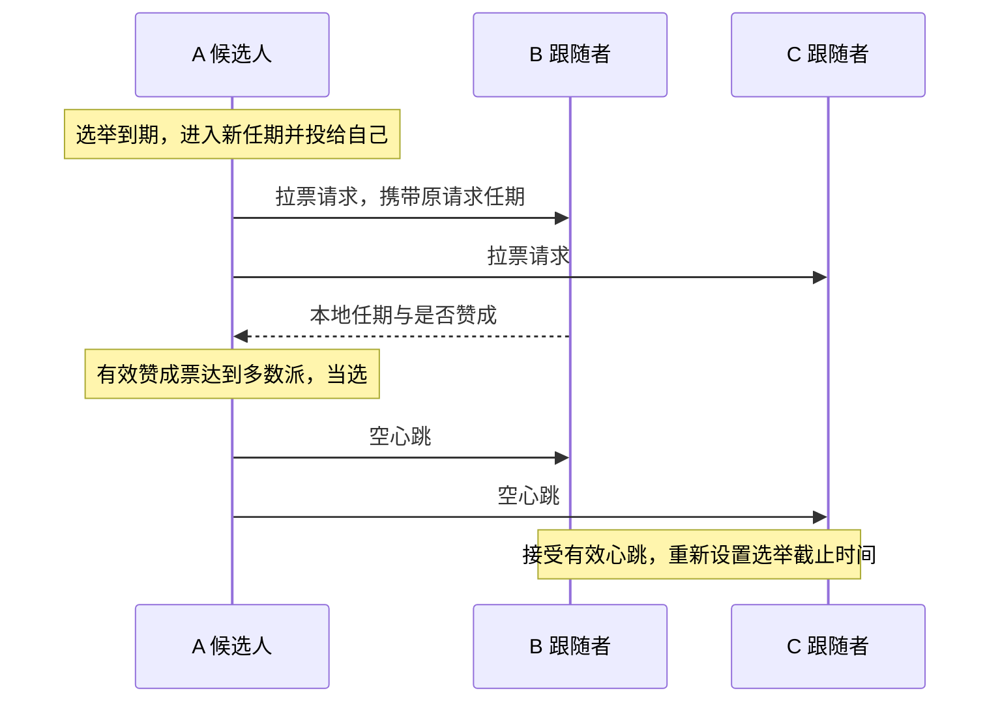

# 代码复习指南（当前3A～3D）

本页说明当前实现的类型、字段、函数和消息流程；完整源码位于私有项目的src/raft1/raft.go。先看职责与状态，再沿调用链阅读。

## 文件与依赖

本目录包含完整可运行的私有学习项目。主要复习 `src/raft1/raft.go`，官方依赖用于复现集成测试，guided_*_test.go则是额外的辅助测试。

| 私有版路径 | 来源与作用 |
| --- | --- |
| `src/raft1/raft.go` | 在官方骨架上练习实现的 Raft 节点，包含中文说明 |
| `src/raft1/guided_state_test.go` | Codex 辅助编写的针对性 Go 测试 |
| `src/raft1/guided_log_test.go` | Codex 编写的 9 个 3B 辅助测试，检查局部行为与边界 |
| `src/raft1/guided_persist_test.go` | Codex编写的3项保存、投票重启与恢复辅助测试 |
| `src/raft1/guided_conflict_test.go` | Codex编写的2项冲突提示、RPC编码与过时回复辅助测试 |
| `src/raft1/raft_test.go` | MIT 官方实验测试，包含 3A～3D；当前3A～3D均有官方验收 |
| `src/raft1/test.go`、`server.go`、`proxy.go`、`util.go` | 官方测试封装与节点运行支持 |
| `src/raftapi/` | 测试器和服务层要求 Raft 提供的接口 |
| `src/labrpc/` | 官方模拟网络，可延迟、丢失请求或回复 |
| `src/labgob/` | 官方编码支持，供通信与当前持久化编码使用 |
| `src/tester1/`、`src/models1/` | 官方测试器、保存容器及测试模型 |
| `src/main/raft1d.go` | 官方测试所需的节点进程入口 |
| `src/go.mod`、`src/go.sum` | Go 模块与依赖信息，保留官方模块名以维持导入路径 |
| 根目录 `Makefile` | 整理版新增的构建和测试入口 |

测试依赖不能当作自己的实现贡献，但为了复现官方测试，私有版也不能只留下一个 `raft.go`。

## 英文速查

| 英文 | 中文含义 |
| --- | --- |
| Raft / peer | 协议 / 集群中的节点 |
| Follower | 跟随者，等待有效领导者消息 |
| Candidate | 候选人，正在拉票 |
| Leader | 领导者，组织复制并定期发送心跳 |
| term | 任期，选举轮次使用的递增编号 |
| vote / votedFor | 选票 / 本任期投给谁 |
| request / reply / response | 请求 / 回复 / 响应 |
| args | 参数，在这里主要指消息正文 |
| From / To | 发送者编号 / 接收者编号 |
| heartbeat | 心跳，3A 中是空的日志追加请求 |
| electionDeadline | 选举截止时刻，简称 lim |
| reset / send / handle | 重新设置 / 发送 / 处理 |
| Locked | 调用者已经持锁，该辅助函数不能再次获取同一把锁 |

## 类型与状态

Go 中这里使用结构体及方法，没有额外设计一个 C++ 风格的 class。一个 `Raft` 对象表示一个节点，不是整个集群；使用 `*Raft` 让方法操作同一对象，避免复制节点状态和互斥锁。

| 类型 | 用途 | 关键字段 |
| --- | --- | --- |
| `LogEntry` | 一条日志，全局位置由边界与切片偏移共同确定 | `Term` 是产生任期，`Command` 是交给服务层的命令 |
| `Role` | 表示节点当前身份，底层是整数 | `Follower`、`Candidate`、`Leader` 三个常量 |
| `Raft` | 保存本节点的配置与状态 | 见下表 |
| `RequestVoteArgs` | 拉票请求正文 | `Term`、`CandidateId`、`LastLogIndex`、`LastLogTerm` |
| `RequestVoteReply` | 接收者作出的拉票回复 | `Term`、`VoteGranted` |
| `VoteRequestMessage` | 待发送请求的本地信封 | `From`、`To`、`Args` |
| `VoteReplyMessage` | 将原请求信息与实际回复关联 | `From`、`To`、`RequestTerm`、`Resp` |
| `AppendEntriesArgs` | 日志复制或空心跳正文 | `Term`、`LeaderId`、`PrevLogIndex`、`PrevLogTerm`、`Entries`、`LeaderCommit` |
| `AppendEntriesReply` | 本次日志请求的答复 | `Term`、`Success`、失败时的发送起点提示`Nxtbgidx`；不代表已经提交 |

`Raft` 中的字段：

| 字段 | 用途 |
| --- | --- |
| `mu` | 互斥锁，保护可能被多个协程同时访问的状态 |
| `peers` | 固定集群的通信端点，包含自己，断网不改变人数 |
| `me` | 本节点在 peers 中的下标 |
| `persister` | 官方保存容器，保存编码后的协议状态及配套快照，重启时读取 |
| `currentTerm` | 本节点目前知道的最大任期 |
| `votedFor` | 本任期投给的候选人编号；-1 表示未投票 |
| `role` | 当前身份 |
| `votes` | 本轮已收到的赞成票，按节点编号去重 |
| `electionDeadline` | 跟随者或候选人下一次可以发起选举的截止时刻 |
| `log` | 保留日志，log[0]为快照边界占位；全局位置=lstincludeidx+切片下标 |
| `commitIndex` | 本节点已知的已提交前缀末尾 |
| `lastApplied` | 已按顺序交付给服务层的最后位置 |
| `applyCh` | 交付 `ApplyMsg` 的通道，发送时不持锁 |
| `nextIndex` | 领导者下一次给各节点发送日志的起点 |
| `matchIndex` | 领导者已确认各节点复制到的位置 |

心跳计划时刻 `nextHeartbeat` 是 ticker 的局部变量；它控制发送间隔，不是选举截止时间。投票现在比较真实日志末尾：先任期，后位置；只有哨兵时末尾为 (0, 0)。

## 函数职责与锁约定

下表覆盖当前实现中 `raft.go` 中的全部函数，覆盖已实现的接口与辅助函数。

| 函数 | 谁使用、负责什么 | 返回或结果 | 锁的约定 |
| --- | --- | --- | --- |
| `Make` | 初始化状态、哨兵日志和通道，恢复保存状态后启动计时与应用协程 | 返回节点接口 | 在启动协程前完成初始化 |
| `GetState` | 测试器或服务层查询当前状态 | 当前任期、是否为领导者 | 自行加锁 |
| `majority` | 选举和计票逻辑计算固定集群多数派门槛 | 严格过半的最低票数 | 只读取初始化后固定的配置 |
| `observeHigherTermLocked` | 请求或回复处理逻辑发现更高任期后更新状态并退位 | 清除旧任期投票和计票；非更高任期不修改 | 调用者持锁 |
| `onElectionTimeoutLocked` | 开启选举时完成本地身份转换 | 任期递增、成为候选人、投给自己 | 调用者持锁 |
| `startElection` | 未持锁的调用者或辅助测试发起选举 | 待发送的拉票消息切片 | 自行加锁，再调用持锁版本 |
| `startElectionLocked` | 后台循环在锁内确认超时后发起选举 | 初始化本轮计票，生成请求；单节点可当选 | 调用者持锁 |
| `RequestVote` | 其他候选人通过 RPC 向本节点拉票 | 在 reply 中填写任期和是否赞成 | 自行加锁 |
| `sendRequestVote` | 发送逻辑向一个指定节点拉票 | 通信是否成功，实际回复写入参数 | 网络等待时不持锁 |
| `sendVoteRequests` | 将一组已经准备好的拉票请求并发发送 | 每个回复关联原请求后交给计票函数 | 网络等待时不持锁 |
| `handleRequestVoteResp` | 收到拉票回复后检查任期、竞选身份并计票 | 更高任期退位，多数票当选 | 自行加锁 |
| `AppendEntries` | 核对任期与前置日志，补齐或修复日志后缀，更新本机提交位置 | 回复任期、是否接受及前置失败时的发送起点提示，不等于已应用 | 自行加锁 |
| `sendHeartbeats` | 分别按各节点进度发送日志、空心跳或快照，名称沿用 3A | 将原请求与回复交给进度处理函数 | 锁内准备，锁外发送 |
| `resetElectionDeadlineLocked` | 需要重新等待时设定新的截止时刻 | 当前时刻之后随机 500～799 ms | 调用者持锁，或初始化时尚无并发 |
| `ticker` | 后台循环根据身份检查选举与心跳时间 | 选举到期生成请求；心跳到期安排发送 | 锁内判断更新，锁外发送和休眠 |
| `Start` | 领导者接受命令，追加本地日志并检查提交条件 | 返回位置、任期、是否为领导者；不保证最终提交 | 自行加锁 |
| `becomeLeaderLocked` | 切换为领导者，重建本任期复制进度 | 初始化 nextIndex、matchIndex | 调用者持锁 |
| `buildAppendEntriesLocked` | 按指定节点发送起点打包日志请求 | 含独立条目数组的请求；起点到末尾时为空心跳 | 调用者持锁 |
| `handleAppendEntriesReply` | 关联原请求与回复，处理任期、推进或回退复制进度 | 成功后检查多数派提交，忽略过时回复 | 自行加锁 |
| `advanceCommitIndexLocked` | 找出当前任期已达多数派的最远位置 | 推进 commitIndex，旧前缀随之提交 | 调用者持锁 |
| `applier` | 唯一应用协程，优先交付快照，再按位置交付已提交命令 | 经 applyCh 发送，再推进 lastApplied | 锁内取消息，锁外发送，锁内记录 |
| `persist` | 3C 在任期、投票或日志变化后保存状态 | 按固定顺序编码后统一保存 | 调用者持锁 |
| `readPersist` | 3C 创建节点时恢复先前保存的数据 | 完整解码到临时变量后恢复协议状态与快照边界 | 启动后台任务前执行 |
| `PersistBytes` | 查询已保存状态的大小 | 返回官方容器中已保存状态的字节数 | 容器自行加锁 |
| `Snapshot` | 3D 接收服务层快照并压缩日志 | 保存边界、独立后缀与快照 | 自行加锁 |

## 选举消息时间线

发送函数的通信成功不等于投票成功：RPC 收到明确拒绝也可以正常返回。请求与回复通过网络传内容，不共享对方的结构体指针。

## 原请求任期与回复任期

`RequestTerm` 是发送者当初发出请求的任期，`Resp.Term` 是接收者处理请求时知道的任期。前者由发送端保留，不需要接收者额外返回。

例子：A 在任期 3 发出拉票请求，随后超时进入任期 4，旧回复才到。它仍属于任期 3，不能计入任期 4；但若旧回复中携带任期 5，A 必须承认更高任期并退位。因此先检查更高任期，再检查旧轮票是否应忽略。

## 选举计时重置规则

每次重置都是“当前时刻 + 新随机等待长度”，覆盖旧值，不在旧截止时间上累加。记忆方式是：启动先等，竞选再等，投票让他选，心跳跟他走。

| 事件 | 重置选举截止时间吗 |
| --- | --- |
| 初始化节点 | 是 |
| 开启新一轮选举 | 是，给新一轮完整等待时间 |
| 同意投给某个候选人，包括同候选人的重复请求 | 是 |
| 收到当前或更高任期的领导者日志请求/心跳，即使前置日志不匹配 | 是 |
| 拒绝竞争候选人或旧任期请求 | 否 |
| 收到旧任期心跳 | 否 |
| 收到别人投给自己的回复 | 否，继续等本轮原截止时间或当选 |
| 单纯发现更高任期 | 辅助函数本身不重置，取决于所在路径是否授予投票或收到有效任期的领导者请求 |

## 后台循环与锁

Leader 检查心跳发送时间，到期发消息，仍保持 Leader；Follower 检查选举截止时间，到期成为 Candidate；Candidate 到期则进入更高任期重试。心跳发送失败不会自动让当前实现中的 Leader 退位，它在发现更高任期时才退位。

循环每轮末尾休眠约 20 ms，心跳轮次至少间隔约 100 ms，选举等待随机 500～799 ms。这些是当前实验实现参数，不是所有 Raft 系统必须使用的固定常数。

检查选举超时和开启新一轮选举在同一把锁内完成。否则“检查到期 → 解锁 → 收到有效心跳并延期 → 仍按旧判断选举”的时间线会造成不必要选举。网络等待放在锁外；Go 的互斥锁不能重复获取，名字带 Locked 的辅助函数约定调用者已经持锁。

## 日志复制、提交与交付

先读 `LogEntry` 和 `Start`，再读 `buildAppendEntriesLocked`、`sendHeartbeats`、接收端 `AppendEntries`，最后读复制回复、提交判断和 `applier`。一轮命令的流程是：本地接受 → 请求打包 → 网络复制 → 接收者核对与修复 → 发送者确认进度 → 多数派提交 → 按位置交付。

三节点例子：A 在任期5接受命令，放到位置2；B复制成功后回复，A确认B复制到2。A自己加B构成多数派，且位置2产生于当前任期，A把提交位置推进到2。之后A通过请求告诉B已提交到2，B更新自己已知的提交位置；各节点的应用协程独立按顺序交付。C暂时断网不妨碍多数派提交，恢复后再通过前置核对、回退发送起点和后缀复制追赶。

必须分清四个状态：有本地副本、达到提交条件、本节点知道已提交、本节点已经交付。成功 RPC 不等于日志被接受；成功复制不等于多数派提交；领导者已提交不等于所有跟随者都已获知；消息已交付不等于 Raft 收到了业务执行完成确认。

## 持久化与重启恢复

论文Figure 2中的currentTerm、votedFor和log需要跨重启保留。persist按固定顺序编码任期、投票、日志和快照边界，完整编码后交给官方Persister；readPersist按相同顺序解码到临时变量，全部成功后再恢复节点。空数据保留首次启动的默认状态，解码错误不会当作首次启动忽略。Make在启动ticker和applier之前完成读取与恢复。

快照边界修改时也要保存。保存路径包括发现更高任期、开启选举并投给自己、授予选票、Start追加命令，以及AppendEntries修改日志后缀。状态需要在依赖它的答复或后续消息对外生效前保存；仅更新提交或交付进度不触发协议状态保存。身份、选举计时、复制进度及提交与交付位置不随这份数据恢复，节点重启先作为跟随者运行。

当前Save统一保存协议状态和snapshotBytes，普通保存也保留已有快照。Make恢复边界与快照字节，commitIndex和lastApplied从边界开始；2026服务层自行恢复初始业务快照。这里的持久化指实验保存容器中的重启恢复，没有实现生产磁盘WAL。

## 前置失败的追赶提示

AppendEntriesReply.Nxtbgidx是前置核对失败时建议的下一次发送起点：本地日志太短时返回全局末尾加一，任期不匹配时返回本地冲突任期连续段的起点。领导者仍先检查任期和原请求，再处理对应当前发送起点的失败。这个优化跳过无效探测区间，不改变前置核对和后缀修复规则。具体故障与边界见[工程案例001](engineering-cases.md)。

## 3D新增状态、消息与函数

| 项目 | 用途及锁约定 |
| --- | --- |
| lstincludeidx | 快照覆盖的全局末尾；可变共享状态，持锁访问 |
| snapshotBytes | 服务层提供的快照字节；不解析业务内容，保存时与边界配套 |
| pendingSnapshot | 等待applier交付的消息；持锁取出并清空，发送在锁外 |
| InstallSnapshotArgs / Reply | 请求含任期、领导者、边界位置/任期和字节；回复含当前任期 |
| lastLogIndexLocked | 返回全局末尾；调用者持锁 |
| logOffsetLocked | 全局位置减边界得到切片下标；调用者先检查范围并持锁 |
| InstallSnapshot | 接收远端快照，核对任期与陈旧性，保留匹配后缀或舍弃，保存后安排交付；自行加锁 |
| buildInstallSnapshotLocked | 打包边界和独立字节副本；调用者持锁 |
| sendInstallSnapshot | 锁外RPC，成功通信后交给回复处理；不持锁等待网络 |
| handleInstallSnapshotReply | 先承认更高任期，再过滤旧轮结果，单调确认请求边界；自行加锁 |

3D没有另建logTermLocked，边界任期直接由log[0].Term保存。当前raft.go共31个函数；上表补充原表之外六个函数。Snapshot已实现；applier优先处理待交付快照，再按全局位置输出普通命令。

压缩示例：快照覆盖80，末尾100，则切片保存边界占位和81～100，共21项。访问全局81用下标1，末尾为80+21-1=100。A给落后B的起点是51时先发S80；B保存后安排交付，A收到当前任期回复只确认到80，再发送81以后。快照回复不是服务业务执行完成的确认。
